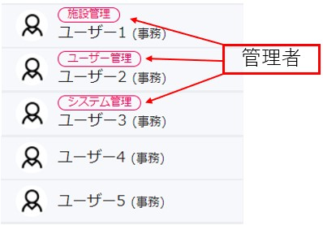
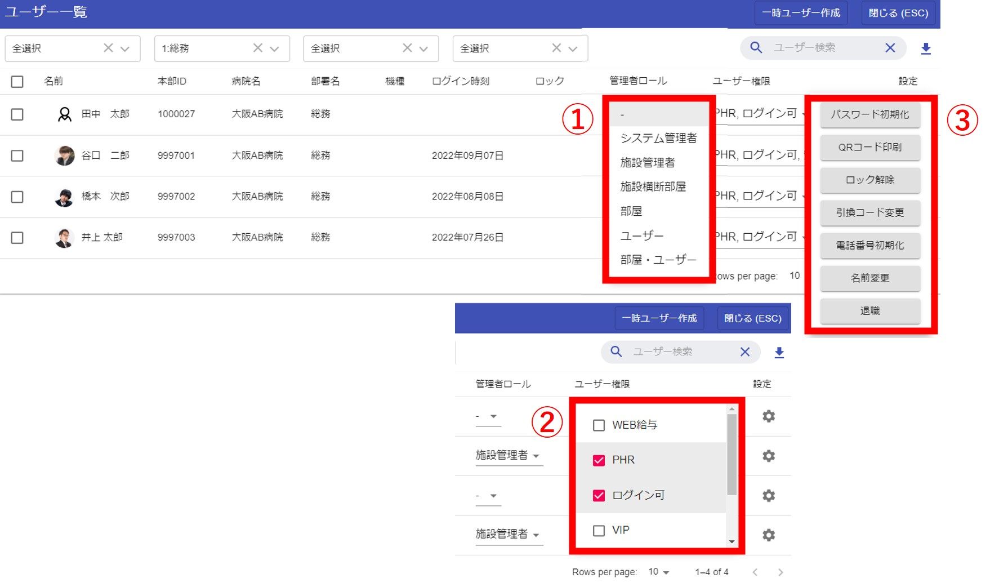

管理者は名前の上にマークがつきます。  
  

[ブラウザ版の全体メニュー](pc_menu.md#_1)の[ユーザー一覧](user.md)画面で、管理者ロール・ユーザー権限・初期化の設定ができます。    
## <ユーザー一覧画面>  
  

### ①管理者ロール

以下、6つの内から1つだけ管理者ロールを選ぶことができます。  

#### 1.システム管理者
システム全体の管理者となり、以下の2.～5.すべての権限を持ちます。(TIS所属の一部ユーザーにのみ付与されています)  

#### 2.施設管理者
※施設のSEには最初からこの権限が付与されています  

- [ブラウザ版の全体メニュー](pc_menu.md#_1)から、自施設＋子施設の部屋一覧画面を表示できます。(グループの作成・削除・ユーザー追加ができます)  
- [ブラウザ版の全体メニュー](pc_menu.md#_1)から、自施設＋子施設の[ユーザー一覧](user.md)画面を表示できます。(ユーザーのパスワード初期化・権限付与ができます)  
- [ブラウザ版の全体メニュー](pc_menu.md#_1)から、[安否確認](anpi.md)画面を表示できます。(安否確認の作成・集計・分析ができます)  
- [ユーザー一覧](user.md)画面で、他のユーザーの管理者権限を変更することができます。(管理者を増やすことができます。)  
- [お知らせ](notice.md)を作成することができます。  

#### 3.施設横断部屋

- [ブラウザ版の全体メニュー](pc_menu.md#_1)から、全施設の部屋一覧画面を表示できます。(グループの作成・削除・ユーザー追加ができます)    
※他施設のユーザーを含んだグループを作成することができるため、施設を横断した部会や、委員会のグループを作成するときにご利用ください  

#### 4.部屋

- [ブラウザ版の全体メニュー](pc_menu.md#_1)から、自施設＋子施設の部屋一覧画面を表示できます。(グループの作成・削除・ユーザー追加ができます)  

#### 5.ユーザー

- [ブラウザ版の全体メニュー](pc_menu.md#_1)から、自施設＋子施設のユーザー一覧画面を表示できます。(ユーザーのパスワード初期化・権限付与ができます)  

#### 6.部屋・ユーザー

- [ブラウザ版の全体メニュー](pc_menu.md#_1)から、自施設＋子施設の部屋一覧画面を表示できます。(グループの作成・削除・ユーザー追加ができます)  
- [ブラウザ版の全体メニュー](pc_menu.md#_1)から、自施設＋子施設のユーザー一覧画面を表示できます。(ユーザーのパスワード初期化・権限付与ができます)  

### ②ユーザー権限

以下、6つの内から複数ユーザー権限を選ぶことができます。

#### 1.WEB給与
スマホ版のメニューから、ご自身の[WEB給与](salary.md)を参照することができます。  
#### 2.健診結果(PHR)
スマホ版のメニューから、ご自身の[健康診断結果](phr.md)を参照することができます。
#### 3.ログイン可
ONの場合は、ログインができます。  
OFFの場合は、ログインができません。
ON→OFFに変更されたユーザーはログイン画面に強制的に遷移します。  
#### 4.VIP
VIP職員には、一般職員(非VIP)からのコンタクト(チャット)ができないようになります。VIP職員→一般職員(非VIP)へのコンタクトは可能です。  
#### 5.安否
安否確認の作成・分析画面を表示できます。  
#### 6.日報
スマホ版のメニューから、[日報](nipo.md)を閲覧できます。  

### ③設定

各種初期化等ができます。  

#### 1.パスワード初期化
[パスワードを初期化](password.md)することができます。  
#### 2.QRコード印刷
スマホ版Chatisインストールに必要なQRコードやログイン情報が記載された[Chatisインストール用QRコード](install.md#_1)を印刷することができます。
#### 3.ロック解除
ログイン時に5回パスワードを間違えた場合はアカウントがロックされます。  
ロックを解除する場合はこのボタンをクリックしてください。  
#### 4.引換コード変更
iOS版Chatisのインストールに必要な[QRコードを初期化](ioscode.md)することができます。  
#### 5.電話番号初期化
機種変更で電話番号が変更になった場合、このボタンをクリックしてください。  
なお、このボタンで[アカウント認証](sms.md)が解除され、WEB給与明細などの個人に紐付くサービスが使用できなくなります。  
#### 6.名前変更
通常、ユーザー本人のみ変更できる名前を管理者は変更できます。  
#### 7.退職
退職扱いにすることができます。退職扱いになったユーザーはユーザー一覧に表示されません。間違って退職扱いにした場合はシステム管理者までお問い合わせ下さい。  
また、退職扱いになったユーザーはチャットを使用できなくなります。  
