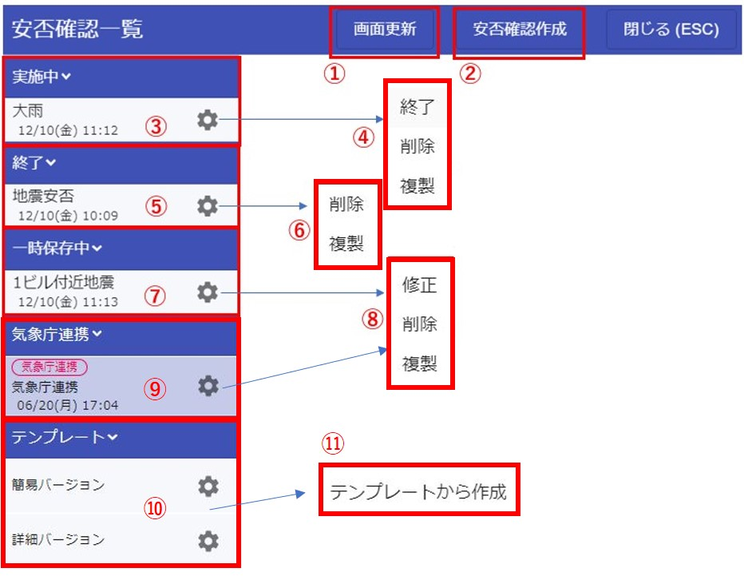

## 概要

施設単位に安否確認を実施する事ができます。（子施設を含むことも可能です。）  
安否確認の作成・分析は権限があるユーザーしかできません。  
安否確認を実施すると、施設のユーザー全てにプッシュ通知が送信されて、安否報告ができるようになります。

安否確認の作成・分析の権限は、[管理者](admin.md)がユーザー一覧画面で設定できます。  
管理者ロールが「施設管理者」「システム管理者」か、ユーザー権限の「安否」がONのユーザーが安否確認の作成・分析ができます。  
  

## 安否報告(ユーザー側の操作)

安否確認が実施されると、端末にプッシュ通知が届きます。  
  

安否確認専用のグループが作成されます。  
  

専用のグループ内に安否確認ボタンがあるので、クリックをすると安否報告画面が起動します。  
  

安否報告画面で自分の状態を報告  
  

安否確認ボタンには、通常のメッセージと同じく「既読」数が表示されます。クリックすると既読画面が起動します。  
  

安否確認専用の既読画面となっており「既読」「未読」「報告済」「未報告」を確認できます。  
「内容確認」をクリックすると、他の人の報告内容を見ることができます。  
  

報告内容は見れますが、変更はできません。  
  

ガラケーユーザーのために、事前にメールアドレスを登録すると
そのメールアドレスにURLが届きます。  
  
  

ブラウザからも安否報告する事ができます。
  

## 安否作成・分析(ブラウザ)

画面左上よりメニューを表示します。  
  

### 安否確認画面
  
①表示されているグラフやデータを最新の状態に更新できます。  
②安否確認を新規作成できます。  
③実施中の安否確認が表示されます。新規に安否確認を送信した場合はここに表示されます。クリックすると内容(概要・詳細)が表示されます。表示された状態で①をクリックするとデータが最新の状態に更新されます。  
④歯車マークを押すと表示されます。  
　終了：実施中の安否確認が終了となり⑤に移動します。終了した場合は、作成された安否確認のグループも削除されて、ユーザーは安否報告ができなくなります。  
　削除：実施中の安否確認が削除されます。削除された場合は復活はできません。  
⑤終了された安否確認が表示されます。クリックすると内容(概要・詳細)が表示されます。  
⑥歯車マークを押すと表示されます。  
　削除：安否確認が削除されます。削除された場合は復活はできません。  
⑦一時保存している安否確認が表示されます。  
⑦歯車マークを押すと表示されます。  
　修正：保存中の安否確認を修正できます。修正画面の中で送信ボタンをクリックすると、安否確認が実施されて、実施中に移動します。  
　削除：実施中の安否確認が削除されます。削除された場合は復活はできません。  
⑨安否確認を作成するためのテンプレートが表示されます。
　簡易バージョン：2問からなる簡単な安否確認テンプレートです。
　詳細バージョン：6問からなる一般的な安否確認テンプレートです。  
⑩歯車マークを押すと表示されます。「テンプレートから作成」を押すと安否確認作成画面が表示されます。  

### 安否作成
  
①安否確認を送信する施設を選択します。初期では自施設のみですが、子施設も選択できます。  
②安否確認のタイトルを入力します。  
③1つの質問内容の塊となります。質問を増やす場合は⑦を押すと増やすことができます。  
④質問のタイトルになります。  
⑤質問の種類になります。「選択肢」と「自由入力」が選択できます。「選択肢」を選択した場合は⑤の質問選択肢を入力する事ができます。 「自由入力」を選択した場合は、⑥は入力しなくても良くなります。  
⑥質問選択肢を入力する事ができます。安否確認を答えるユーザーには選択肢がボタンとして表示されます。  
⑦質問選択肢を増やすことができます。最大10個まで増やせます。  
⑧質問自体を増やすことができます。最大10個まで増やせます。  
⑨安否確認内容を一時保存する事ができます。  
⑩安否確認をグループに送信します。対象者にはプッシュ通知が送信されます。  

### 分析・集計
<概要タブ>  
  
①「実施中」「終了」のステータスの安否確認をクリックすると、現在の集計結果を表示できます。  
②集計結果は「概要」「詳細」で表示できます。  
　概要：全体・部署毎のサマリが表示されます。グラフも表示できて一目で分かるようになっています。  
　詳細：個人毎の回答結果を一覧で表示できます。CSV出力機能もあります。  
③数値をクリックをする事でグラフを表示できます。  
④グラフをクリックする事で、クリックした箇所に応じたメンバー一覧画面が表示できます。  
⑤一覧に表示しているメンバーに対してプッシュ通知を送ることができます。  
⑥メッセージは自由に入力する事ができます。  

<詳細タブ>  
  
①フリー入力で一覧を絞り込みができます。  
②CSV出力する事ができます。  
③代理入力する事ができます。初回入力時刻、最終修正時刻はCSV出力する事で確認できます。  
①各種絞り込みができます。CSV出力時はここで絞り込んだ条件で出力されます。  
④一覧から回答を修正する事ができます。  

## 安否作成・分析(スマホ)

メニューを表示します。  
  

### 安否確認画面
  
①実施中タブ:クリックすると実施中の安否確認が④のエリアに表示されます。  
②終了中タブ:クリックすると終了した安否確認が④のエリアに表示されます。  
③一時保存タブ:クリックすると一時保存中の安否確認が④のエリアに表示されます。  
④安否確認表示エリア:安否確認を長押しするとメニューが表示されます。  
⑤安否確認を作成する事ができます。  

<<安否確認長押しでのメニュー>>  
  
終了:安否確認を終了します。終了した安否確認は②の終了タブに移動します。  
削除:安否確認を削除します。削除した安否確認は見れなくなります。  

<<サマリ画面>>  
安否確認をクリックすると安否確認の回答結果をサマリ表示できます。それぞれの回答結果をクリックすると回答者一覧画面が表示されます。  
初期状態では自分の部署の回答結果が表示されています。他部署を見たい場合は、対象部署から部署を選択できます。  
  

<<回答者一覧画面>>  
  
①回答した名前と人数が表示されます。  
②一覧に表示されているメンバーにプッシュ通知を送ることができます。(例:未回答者に「回答してください」等)  
③メンバーの回答内容を見ることができます。  

### 安否作成
  
①安否確認を送信する施設を選択します。初期では自施設のみですが、子施設も選択できます。  
②安否確認のタイトルを入力します。  
③1つの質問内容の塊となります。質問を増やす場合は⑦を押すと増やすことができます。  
④質問のタイトルになります。  
⑤質問の種類になります。「選択肢」と「自由入力」が選択できます。「選択肢」を選択した場合は⑤の質問選択肢を入力する事ができます。 「自由入力」を選択した場合は、⑥は入力しなくても良くなります。  
⑥質問選択肢を入力する事ができます。安否確認を答えるユーザーには選択肢がボタンとして表示されます。  
⑦質問選択肢を増やすことができます。最大10個まで増やせます。  
⑧質問自体を増やすことができます。最大10個まで増やせます。  
⑨安否確認内容を一時保存する事ができます。  
⑩安否確認をグループに送信します。対象者にはプッシュ通知が送信されます。  
