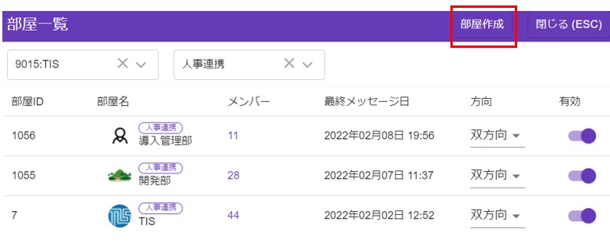
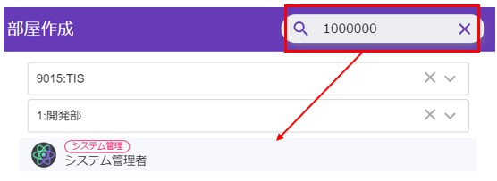
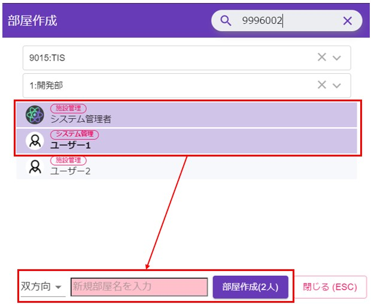

# 部会グループ管理

施設を横断してグループを作成できる権限を持った[管理者](admin.md)は、部会グループなどを作成/管理する事ができます。

## 部会グループ作成
部屋一覧画面を開いて、右上の「部屋作成」ボタンをクリックします。
  

権限を持ったユーザーは、右上に本部IDを入力する欄が表示されます。  
ここに本部IDを入力してエンターまたは、虫眼鏡ボタンクリックをすると、そのユーザーが一覧に表示されます。  
  

表示されたユーザーをクリックするとそのユーザーを含んでグループを作成する事ができます。  
再度、右上から本部IDを入力して検索する事によってユーザーをどんどん追加する事ができます。  
  

## 部会メンバー管理

部屋一覧画面を開いて、グループ数をクリックする事でグループの管理ができます。  
  
