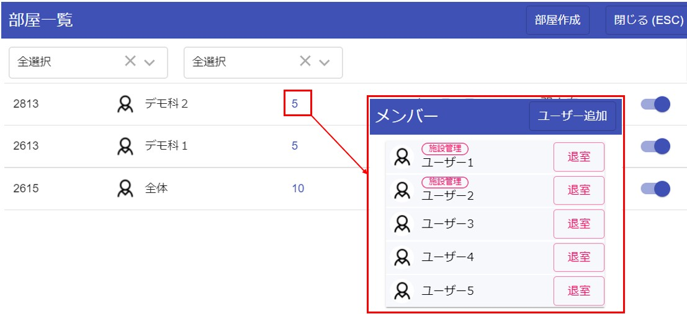

# 部会グループ管理

施設を横断してグループを作成できる権限を持った[管理者](admin.md)は、部会グループなどを作成/管理することができます。

## 部会グループ作成
[部屋一覧](pc_group.md#_2)画面を開いて、右上の「部屋作成」ボタンをクリックします。
  

権限を持ったユーザーは、右上に本部IDを入力する欄が表示されます。  
ここに本部IDを入力してENTERキーまたは、虫眼鏡ボタン

<!-- :fa-search: -->
をクリックをすると、そのユーザーが一覧に表示されます。  
  

表示されたユーザーをクリックするとそのユーザーを含んでグループを作成することができます。  
再度、右上から本部IDを入力して検索することによってユーザーを追加することができます。  
  

## 部会メンバー管理

[部屋一覧](pc_group.md#_2)画面を開いて、グループ数をクリックすることでグループの管理ができます。  
  
