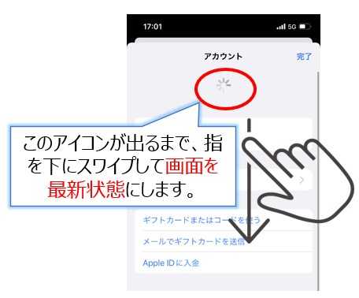
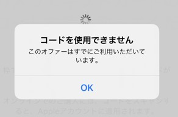

<!-- 文言とかはゲームアプリのマニュアル・よくある質問とかを参考にするとよさそう-->

# よくある質問

## 初めてスマホにChatisをインストールする方法が知りたい

<!-- [こちら](startup.md)をご覧ください。 -->
iOSは[こちら](ios_startup.md)を、Androidは[こちら](android_startup.md)をご覧ください。

## パスワードを忘れた

[管理者](admin.md#1)に、[パスワードを初期化](password.md#1)を依頼してください。  
パスワードの内容は、[管理者](admin.md#1)のみ発行可能な用紙「Chatis インストール用 QR コード」からご確認いただけます。

Chatis で電話番号登録([SMS認証](sms.md))をしている場合は、自身で[パスワードを初期化](password.md)を行えます。

## プッシュ通知が届かない

[こちら](push.md)を参照ください。

## (スマホ版)カメラが使えない・QR コードを読み込めない

[こちら](sp_permission.md)を参照ください。

## (スマホ版)写真・画像を送信できない

[こちら](sp_permission.md)を参照ください。

## グループを作成したい

通常ユーザーは 1 対 1 のコンタクト(チャット)は可能ですが、グループを作成することができません。  
権限のあるユーザーのみ、3 人以上からなるグループを作成できます。  
グループ作成権限は、[管理者](admin.md#1)が付与することができます。

## iOS(iPhone)でアプリのアップデートができない

アカウント画面で必ず「画面を最新状態」にしてからアプリのアップデートをお試しください。  
[アップデート](update.md)をご確認ください。  

## iOS(iPhone)でインストール時に「コードを使用できません」が表示される

下記のようなエラーが発生した場合は、QR コードが既に使われてる可能性があります。  
ユーザー一覧画面を表示できる[管理者](admin.md#1)は[QR コードを初期化](ioscode.md)することができます。管理者に連絡して初期化してください。  

## アプリを消してしまった、再インストールしたい

### iOS(iPhone)の場合

再インストール方法が通常アプリと異なるので、[こちら](install.md#_3)をご確認ください。

### Android の場合

通常アプリと同じ様に GooglePlay から再インストールできます。

##　機種変更をした

### 機種変更で OS が変わった場合

iOS→Android 等、異なるOSで機種変更をした場合は、機種変更後のOSがiOS(iPhone)の場合は[こちら](install.md#_2)を、Android の場合は[こちら](install.md#_5)を参照の上、インストールをお願いします。

### OS が変わらない場合

iOS→iOS等、機種変更でOSが変わらない場合は、iOSの場合は[こちら](install.md#_1)を、Androidの場合は[こちら](install.md#_4)を参照の上、再インストールをお願いします。  
(機種変更後のスマホに紐づくアカウント(iOSではAppleアカウント、AndroidではGoogleアカウント)が機種変更前から変更されていない場合のみ)

## Chatis が表示できない

iOS(iPhone)でファミリー共有を設定しており、ファミリー共有の管理者以外でログインしている場合、Chatis をインストールするとダウンロードはされますがアプリが表示されません。  
ファミリー共有の管理者の Apple アカウントで AppStore にログインするとアプリが表示されるようになります。

## 他の施設のユーザーとグループを作成したい

[こちら](bukai.md)をご参照ください。

## ログインができない

以下の原因が考えられます。

### 1.ログイン情報が間違っている

ログイン URL が「https://chat-tis.com」になっているかご確認ください。  
特に URL 冒頭部分が、「http」では無く「https」になっているか確認お願いします。

### 2.ID が作成されていない(アカウントが存在しない)

Chatis は人事システムと連動しているため、退職した場合・入職処理が正しく行われていない場合、ログインができない場合があります。  
ID が存在するか(アカウントが存在するか)[管理者](admin.md#1)に確認お願いします。

### 3.ログインの許可がされていない

ID が作成されていても、何かしらの原因でログインができない状態になっている場合がございます。  
ログインができる状態か[管理者](admin.md#1)に確認お願いします。
