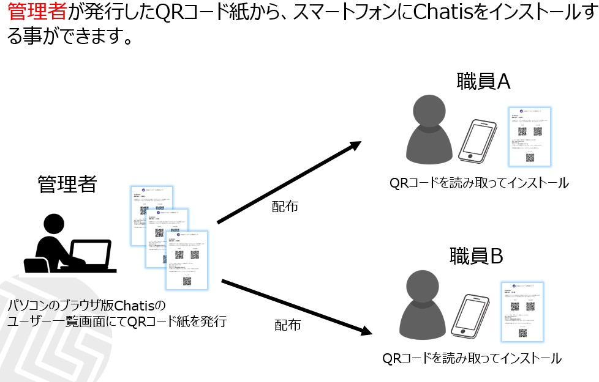
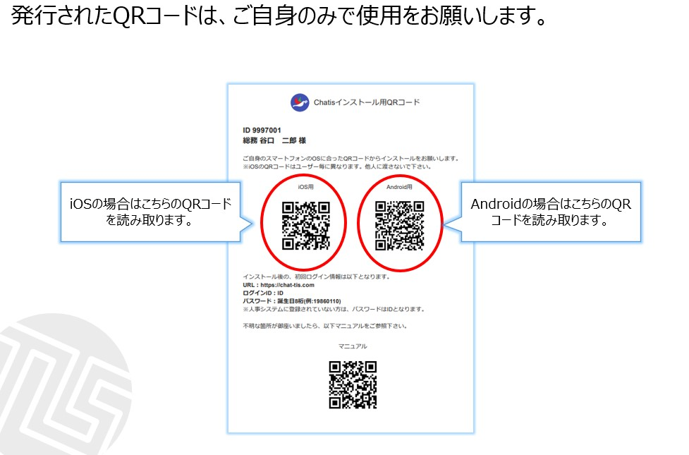
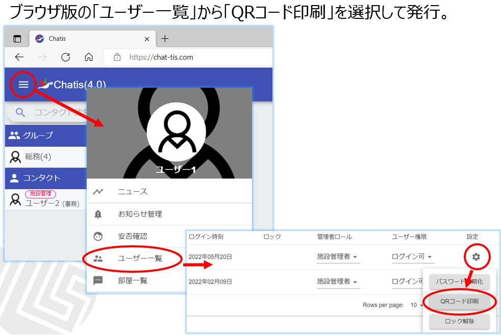

# インストール方法

## iOS
### 初回インストール  
Chatisインストール用QRコードが必要です(管理者のみ発行できます)  
用紙左上の「iOS用」のQRコードをカメラで読み取ってください。  
  
<!--    -->
  

読み取るとスマホに以下の画面が表示されます。  
画面右上の「コードを使う」をタップして、AppleIDとパスワードを入力してください。　
  
<!--    -->  
  
「コードを使用できません」が表示される場合は[こちら](index.md#iosiphone_1)をご覧ください。

### 再インストール
  
誤ってアンインストールしてしまった場合、また機種変更した場合(iOS⇒iOS、かつiPhoneに紐づくAppleIDが同じ場合のみ)以下の手順に沿って再インストールしてください。  
  
AppStoreを起動して、画面右上のプロフィール(人のアイコン)をタップします。  
  
<!--    -->
  
「アカウント」という画面に遷移したあと、画面中央の「購入済み」をタップします。  
  
<!--    -->
  
ダウンロードしたことのあるアプリが一覧で表示されるので、「chatis」を探して雲のマークをタップして、AppleIDとパスワードを入力してください。  
  
<!--    -->
  
  
## Android
### 初回インストール
Chatisインストール用QRコードが必要です(管理者のみ発行できます)  
用紙右上の「Android用」のQRコードをカメラで読み取ってください。  
  
<!--    -->
  
読み取るとスマホに以下の画面が表示されます。  
画面中央の「インストール」をタップして、googleIDとパスワードを入力してください。
  
  
<!--    -->
  
### 再インストール
  
誤ってアンインストールしてしまった場合、また機種変更した場合(Android⇒Androidの場合のみ)は初回インストールと同様の手順で再インストールしてください。  
  
また、GooglePlayで「Chatis」と検索してインストールも可能です。  
  
<!-- ## ブラウザ
   -->

# QRコード発行方法

  
  
  
