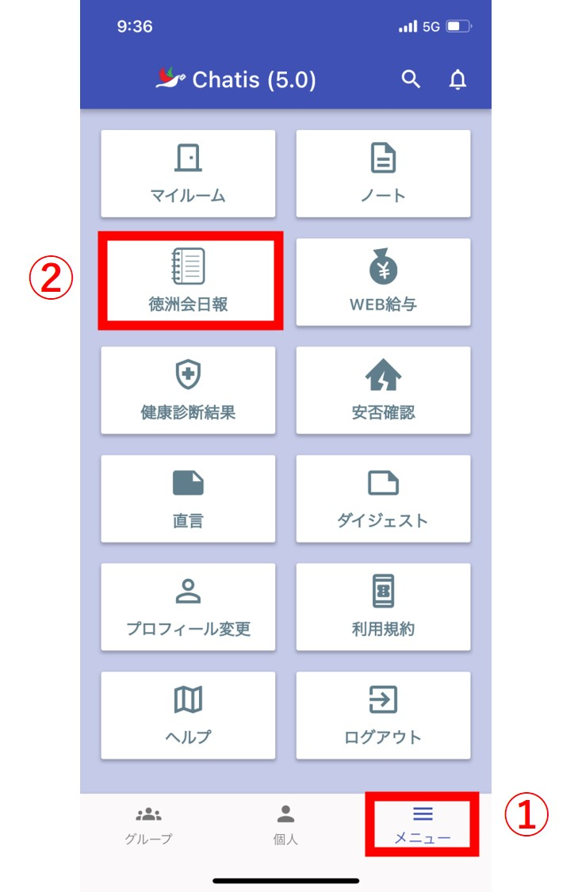
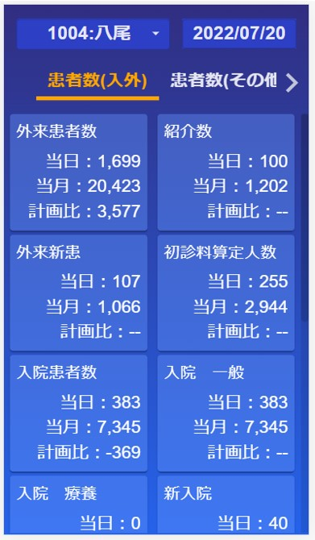
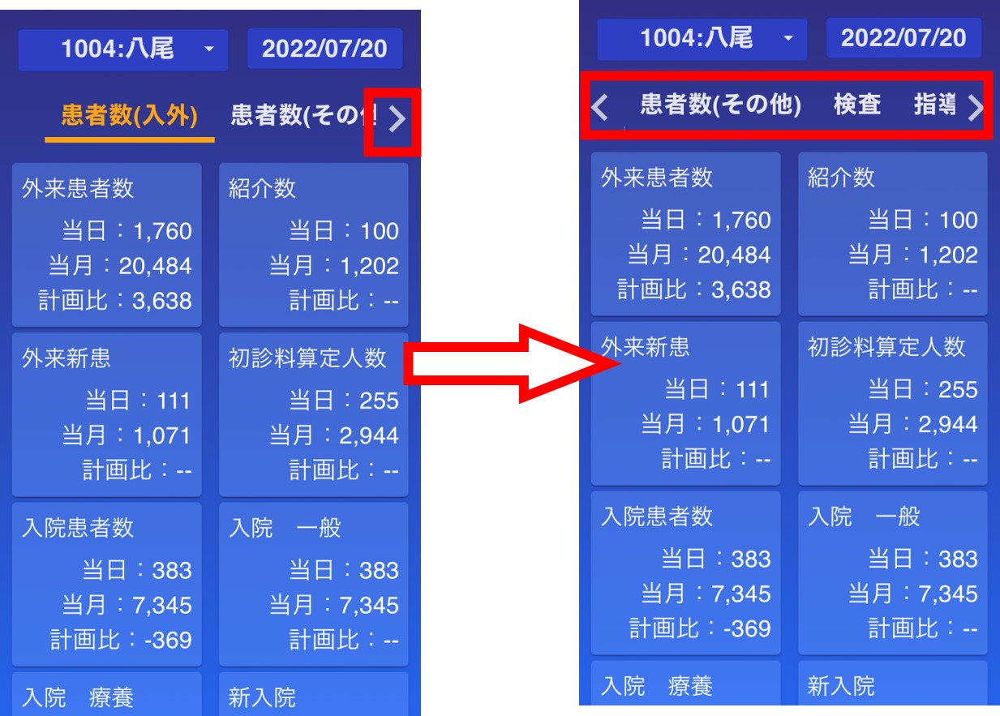
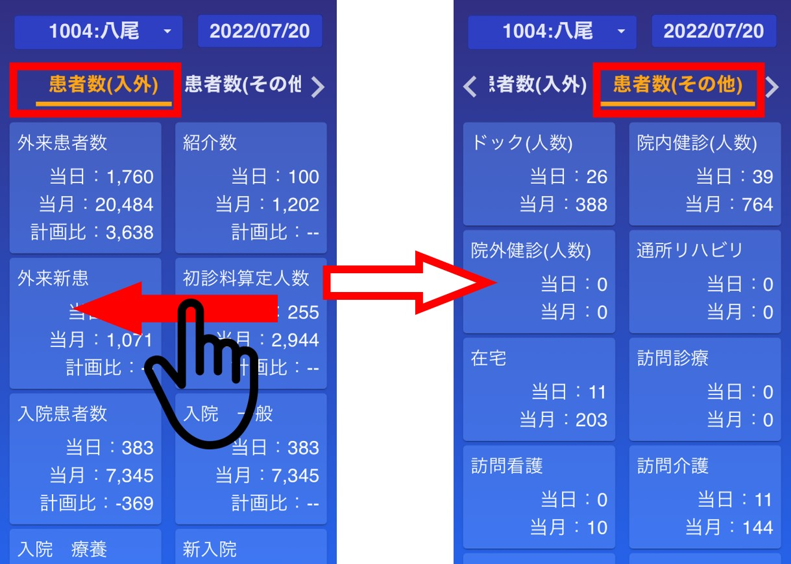
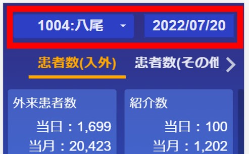
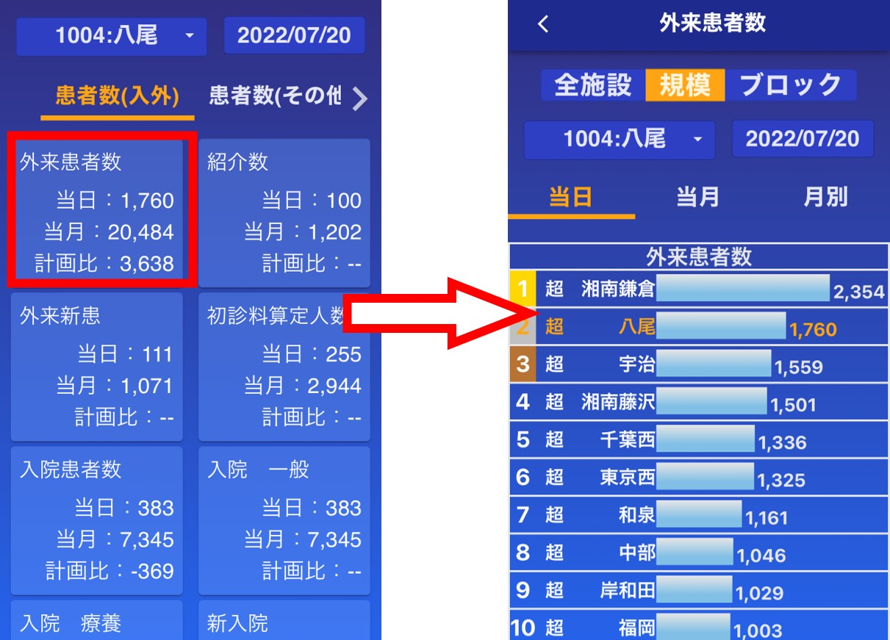
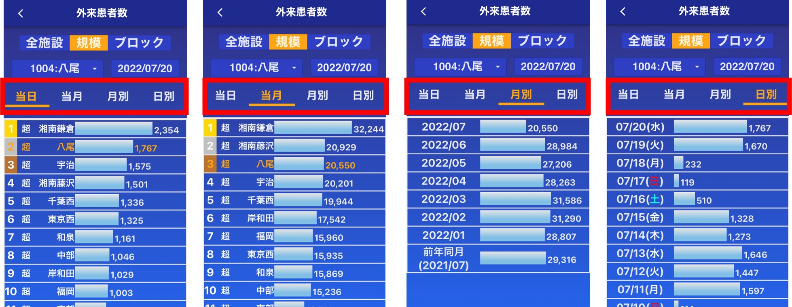
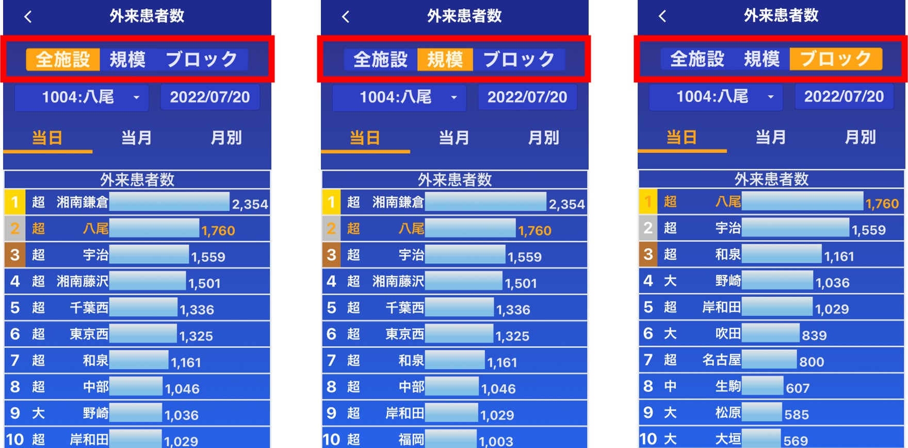
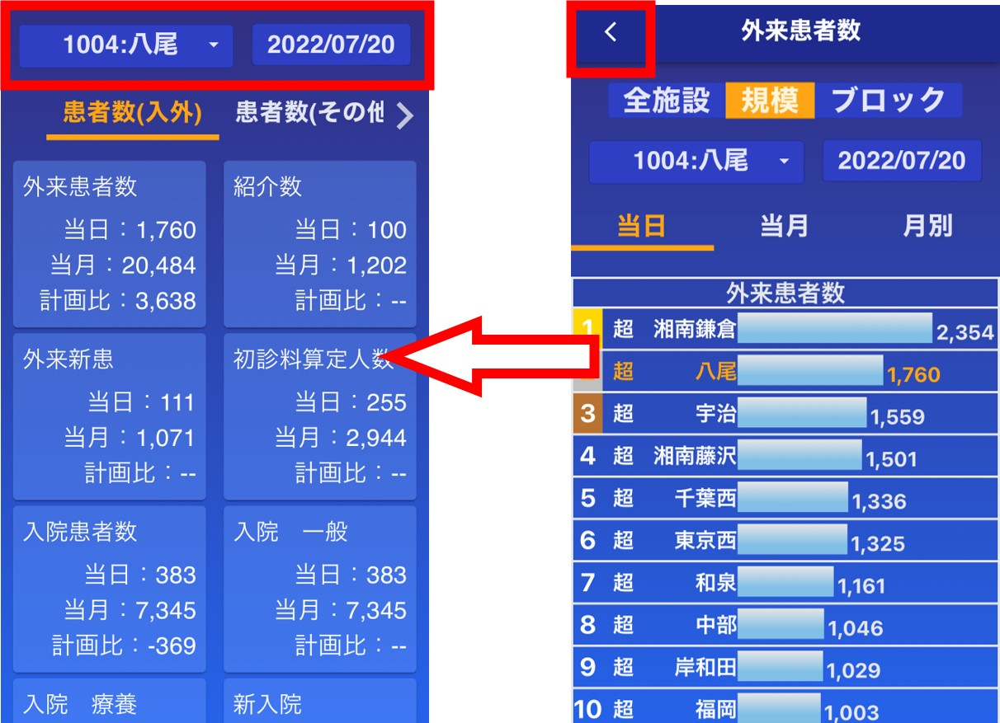

!!! Warning 
    スマホ版のみの機能です。  
    病院の日報のみ実装されています。CL等の日報は実装中です。  

## 日報を見るには

メイン画面(メニュー)から日報を選択します。  
(日報のボタンが表示されてない場合は[管理者](admin.md#2_1)に依頼してください)
　　
<!--    -->

## 画面説明(トップ画面)

自施設の前日の日報を閲覧することができます。
(CL等の病院以外の施設・本部職員はデフォルトで全病院計が選択されています。)  
  

以下の操作で項目を切り替えることができます。  

- タブをタップ(隠れているタブは ＜ボタン もしくは ＞ボタンで表示されます)  
- 左右にスワイプ  
  
<!-- 　　 -->
  
  
<!-- 　  -->
  

タブの項目は以下の通りです。   

- 患者数(入外)  
- 患者数(その他)  
- 検査  
- 指導・リハ  
- 手術  
- 医療講演  
- COVID-19  
  
---  
  
  
施設や日付を変更することができます。  
　　
  
---  
  
    
---  
  

## ランキングページ

施設間の比較や時系列
<!-- 　 -->
  

以下の操作で項目を切り替えることができます。  

- タブをタップ  
- 左右にスワイプ  

項目は以下の通りです  

- 当日  
- 当月(当月の累計)  
- 月別(当月の累計 の 過去半年 **＋** 前年同月)  
- 日別(過去2週間)  
  
  
  
トップ画面と同様に、施設や日付を変更することができます。  
また、画面上部のボタンで全施設・規模・ブロックを切替できます。  
(例：選択施設が八尾の時、規模は超規模、ブロックは関西大阪ブロックを表示)  
!!! Warning 
    月別タブ・日別タブを表示した状態で全施設・規模・ブロックボタンを押しても何も変わりません。  

  
  
  

ヘッダー上の ＜ ボタンでトップ画面へ戻ります。  
この時、ランキングページで施設や日時を変更した場合は変更後の施設・日付の日報が表示されます。  
  
  
  
