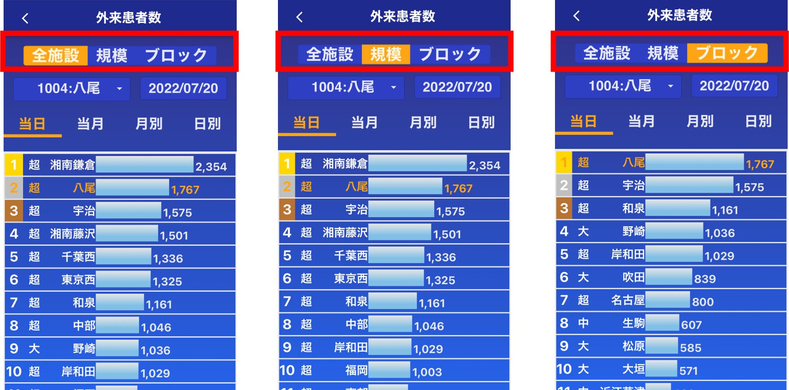
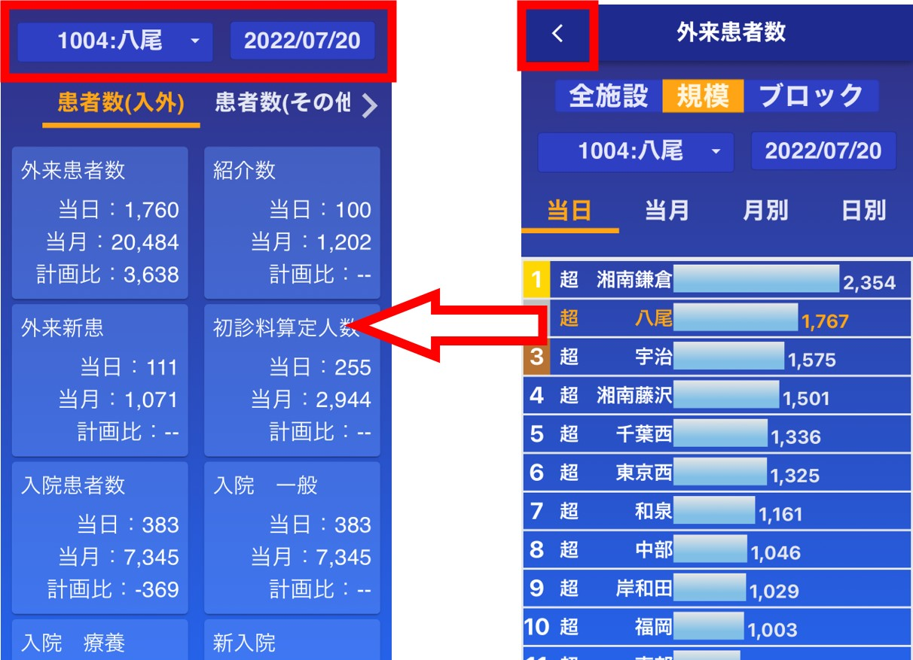

注意点  
※スマホ版のみの機能です。  
※病院の日報のみ実装されています。クリニック等の日報は実装中です。  

メイン画面(メニュー)から日報を選択します。  
(日報のボタンが表示されてない場合は[管理者](admin.md#2_1)に連絡してください)
　　
<!--    -->

## 画面説明

自施設の前日の日報を閲覧することができます。

  

以下の操作で項目を切り替えることができます。  

- タブをタップ(隠れているタブは ＜ボタン もしくは ＞ボタンで表示されます)  
- 左右にスワイプ  
  
<!-- 　　 -->
  
  
<!-- 　  -->
  

タブの項目は以下の通りです。   

- 患者数(入外)  
- 患者数(その他)  
- 検査  
- 指導・リハ  
- 手術  
- 医療講演  
- COVID-19  
  
---  
  
  
施設や日付を変更することができます。  
　　
  
---  
  
    
---  
  

## ランキングページ

施設間の比較や時系列
<!-- 　 -->
  

以下の操作で項目を切り替えることができます。  

- タブをタップ  
- 左右にスワイプ  

項目は以下の通りです  

- 当日  
- 当月(当月の累計)  
- 時系列(当月の累計 の 過去半年 ＋ 前年同月)  
  
  
  
施設や日付を変更することができます。  
また、画面上部のボタンで全施設・規模・ブロックを切替できます。  
(選択施設が八尾の時、規模は超規模、ブロックは関西ブロックを表示)  
(月別タブを表示した状態で全施設・規模・ブロックボタンを押しても何も変わりません)  

  
  
  

ヘッダー上の ＜ ボタンでトップ画面へ戻ります。  
この時、ランキングページで施設や日時を変更した場合は変更後の施設・日付の日報が表示されます。  
  
  
  
