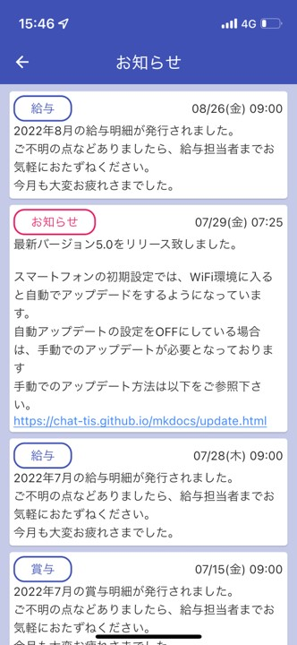
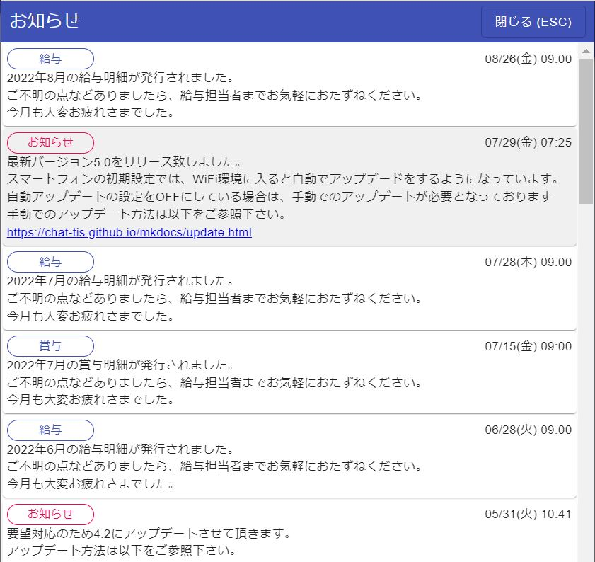
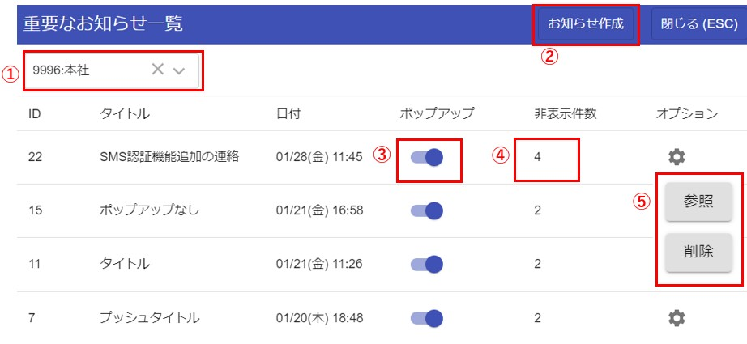
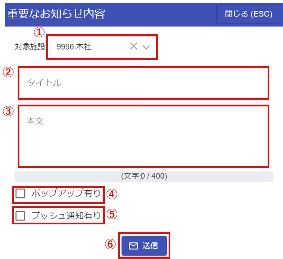
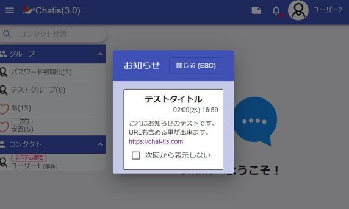
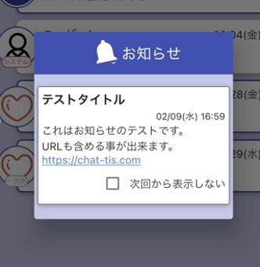

# お知らせ機能

給与明細・賞与明細やアップデート情報を閲覧することができます。  

### スマホ
  

### PCブラウザ
  

## お知らせ作成  

お知らせを作成できる[施設管理者](admin.md#1_2)は、ユーザーに向けてお知らせを案内することができます。  
また、Chatisがアップデートした場合は[システム管理者](admin.md#1_1)からお知らせ機能を使ってご案内いたします。  

  

①選択された施設のお知らせを一覧に表示します。  

②新規にお知らせを作成します。  

③お知らせをユーザーの画面にポップアップ表示するかON/OFFすることができます。  

④ユーザーの画面にポップアップ表示時に、ユーザーが「次回から表示しない」を選択した件数  

⑤作成したお知らせを参照・削除できます。  

---
### お知らせ作成画面  
  

①お知らせを案内する施設を選択できます。  
　基本的には自施設のみですが、子施設がある場合は子施設も表示されます。  

②お知らせのタイトルを入力できます。  

③お知らせの内容を入力できます。(最大文字数400文字)  
　複数行入力することができ、URLも含めることができます。  

④ユーザーの画面にお知らせをポップアップさせるかを選択できます。  

⑤お知らせ送信時にユーザーにプッシュ通知を送信するか選択できます。  

⑥お知らせを送信します。  

---
## ブラウザでのお知らせポップアップ  
送信されたお知らせが、ポップアップONの場合はこのように表示されます。  
「次回から表示しない」にチェックすると次からは表示されません。  
  
---
## スマホでのお知らせポップアップ  
送信されたお知らせが、ポップアップONの場合はこのように表示されます。  
「次回から表示しない」にチェックすると次からは表示されません。  
  

