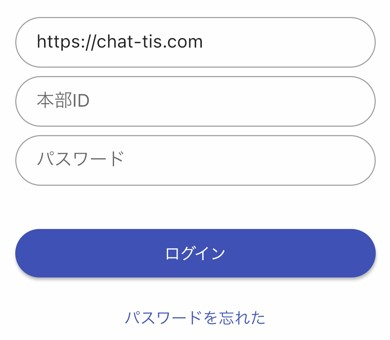
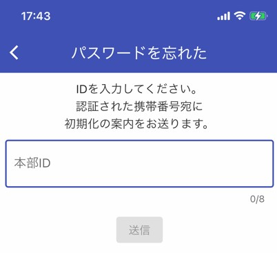
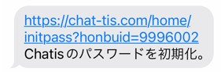
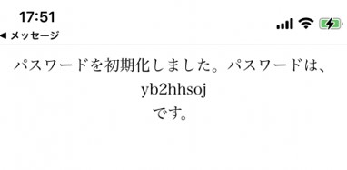
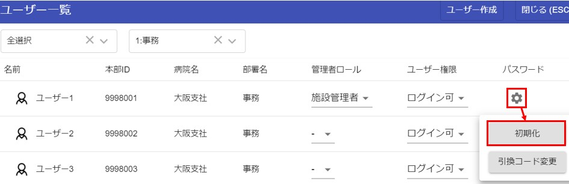

# パスワード初期化

パスワードを初期化する方法は2つあります。  

## ①アカウント認証している場合
[アカウント認証](sms.md)をしている場合は、ログイン画面よりパスワード初期化の手続きが出来ます。  

ログイン画面より、「パスワードを忘れた」をクリックします。  
  
---
自身の本部IDを入力します。  
  
---
[アカウント認証](sms.md)した際の携帯番号宛にSMSメッセージが送信されます。URLをクリックするとパスワードがランダムな文字に初期化されます。
（URLをクリックしないとパスワードは初期化されません）  
  
---
URLをクリックした先にパスワードが表示されているので、こちらをコピーしてログインしてください。  
  

## ②アカウント認証していない場合

ユーザー一覧画面を表示できる[管理者](admin.md)はパスワードを初期化する事ができます。  
初期化された場合、パスワードは生年月日8桁になります。  
(例：1986年1月2日生まれの場合は「19860102」)  
ログイン後パスワード変更をお願いします。  
  
