## 文字入力

最大400文字を入力する事が出来ます。

また「Enterで送信」をON/OFFに切り替える事が出来ます。

  

「Enterで送信」チェックON/OFFでの、改行・送信の対応表

|              | Enter | Shift+Enter | Ctrl+Enter | 
| ------------ | ----- | ----------- | ---------- | 
| **Enterで送信をON**  | 送信  | 改行        | 送信       | 
| **Enterで送信をOFF** | 改行  | 改行        | 送信       | 

---
## ファイル・写真の添付

クリップのアイコンをクリックすると、ファイル選択画面が出てくるので、添付したいファイルを選択します。

添付するとクリップアイコンにマークが付きます。

その後、送信ボタンを押すとファイルが送信されます。
***
ファイルをドラッグ＆ドロップでも添付出来ます。

***
スクリーンショットやSnipingToolで切り取った画像を、そのままメッセージ入力欄に張り付けてファイル添付する事もできます。

---
## スタンプ

自分で画像を登録して、スタンプとして使用する事が出来ます。
顔のアイコンをクリックすると、スタンプ画面が表示されます。

***
(＋)マークを押すと、スタンプ追加画面が表示されるので、好きな画像を登録します。
※拡張子がpngで背景が透過の画像を登録すると、スタンプらしく登録されます。

***
相手から送られたスタンプは、自分のスタンプにする事もできます。

---
## 既読の確認

メッセージが既読になると、既読文字が表示されます。

既読文字をクリックすると、そのメッセージの既読・未読状況を確認できます。

---
## 返事

相手のメッセージに対して返信する場合は、メッセージの右下の「▽」ボタンをクリックします。
その後、「返信する」をクリックします。

***
返信モードになると、テキスト入力欄の上にピンク色で返信元メッセージが表示されます。
この状態でメッセージを送信すると、返信できます。

***
返信メッセージはこのように表示されます。

赤枠の返信元メッセージをクリックすると、返信履歴が表示されます。

---
## 修正

自分のメッセ－ジのみ修正出来ます。

修正すると、メッセージに「修正あり」と表示されます。

「修正あり」をクリックすると、修正履歴が表示されます。
他人の修正履歴は表示できません。

---
## アンケート

グループ毎にアンケートをする事が出来ます。

テキスト入力欄の左下からアンケート画面を開く事が出来ます。

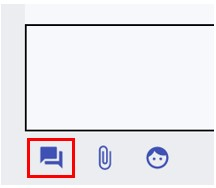

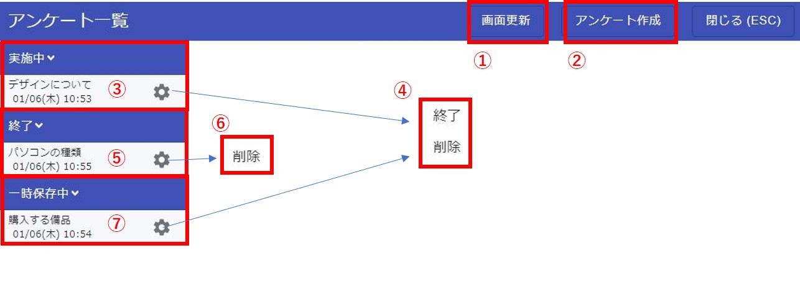
---
### 作成

新規作成する場合は「アンケート作成」ボタンをクリックします。

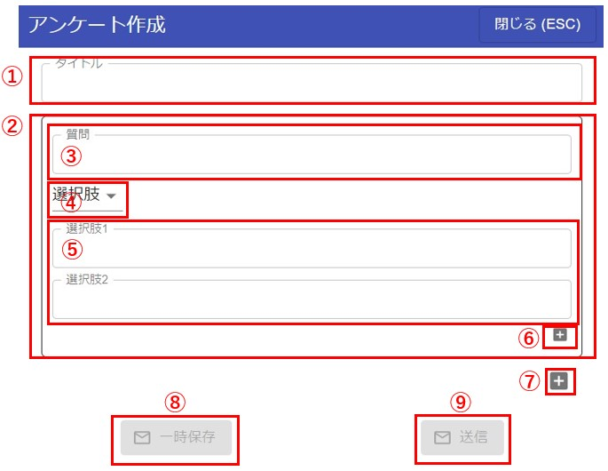

アンケート作成画面の説明です。  
①アンケートのタイトルを入力します。  
②1つの質問内容の塊となります。質問を増やす場合は⑦を押すと増やすことが出来ます。  
③質問のタイトルになります。  
④質問の種類になります。「選択肢」と「自由入力」が選択できます。「選択肢」を選択した場合は⑤の質問選択肢を入力する事ができます。
「自由入力」を選択した場合は、⑤は入力しなくても良くなります。  
⑤質問選択肢を入力する事ができます。アンケートを答えるユーザーには選択肢がボタンとして表示されます。  
⑥質問選択肢を増やすことが出来ます。最大10個まで増やせます。  
⑦質問自体を増やすことができます。最大10個まで増やせます。  
⑧アンケート内容を一時保存する事ができます。  
⑨アンケートをグループに送信します。グループのメンバーにはプッシュ通知が送信されます。  
---
### 一覧表示

アンケートの内容を見ることが出来ます
「実施中」「終了」のアンケートをクリックすると「概要」「詳細」のタブが出てきます。

<概要タブ>  
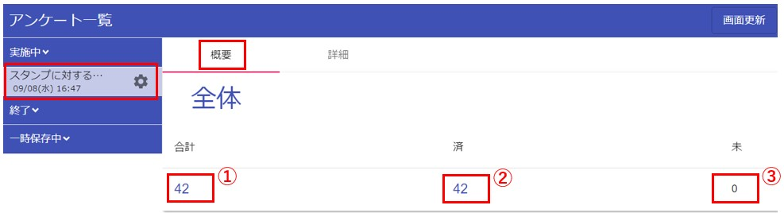

①グループ内のメンバーの合計数です。クリックするとそのメンバーのグラフが表示されます。  
②アンケートを答えたメンバーの数です。クリックするとそのメンバーのグラフが表示されます。  
③アンケートを答えていないメンバーの数です。クリックするとそのメンバーのグラフが表示されます。  
グラフは以下のイメージです。  
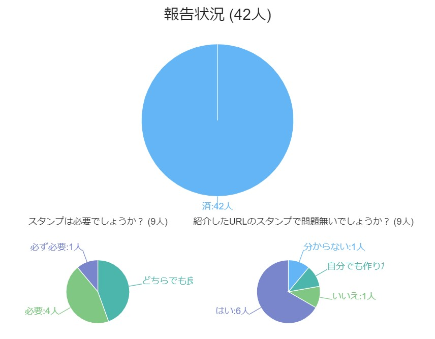

グラフをクリックすると、クリックした場所に応じて、メンバー一覧が表示されます。  
↓例は、「はい」をクリックした時に表示されるメンバー一覧です。  
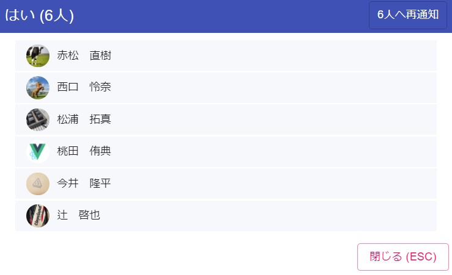

---
<詳細タブ>  
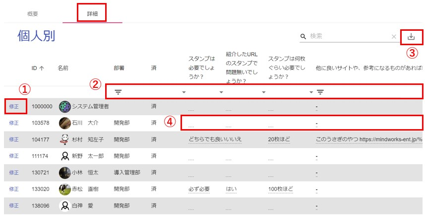
①代理入力が出来ます。  
②一覧の絞り込みが出来ます。（例：「はい」と答えた人だけを絞り込み等）  
③CSV出力が出来ます。画面で絞り込みを行っている場合は、絞り込んだ状態で出力されます。  
④各項目毎に対しても、代理入力が出来ます。

---
## ノート
### 個人ノート
  
画面右上のアイコンより個人ノートを起動できます。
自分しか見ることができないノートになっています。  
スマホ版にもノート機能があり、入力したデータは同期されます。

---
### 共有ノート
それぞれのメンバーとで、ノートを共有できます。
1対1のコンタクトや、多人数のグループにノートが存在します。
そのメンバー内のみ見れるノートになります。  

チャット画面の右のメニューよりノートを選択します。  
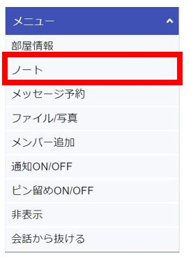

共有ノートは、自分以外も書き込み・削除を行う事ができます。保存されるデータは後勝ちとなります。
そのため、間違って誰かがデータを消してしまうと、共有してるメンバー全てに影響が発生します。
---
## ファイル一覧
コンタクト・グループに送ったファイル一覧を見ることが出来ます。  

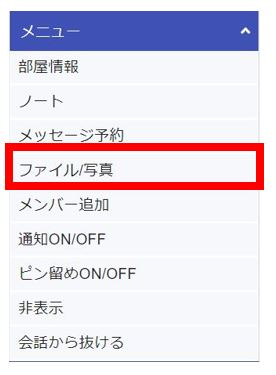  
チャット画面の右のメニューより「ファイル/写真」を選択すると、ファイル/写真一覧画面が表示されます。  

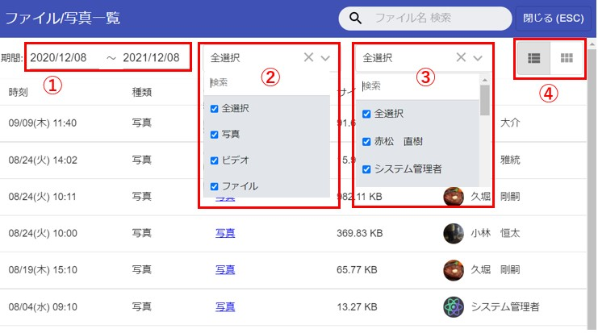
①ファイルが送信された期間を選択出来ます。  
②ファイルの種類を選択できます。  
③送信したメンバーを選択出来ます。  
④表示形式を変更できます。「一覧」「サムネイル」の選択ができます。「サムネイル」を選択すると写真が検索しやすくなります。  

<サムネイル表示>
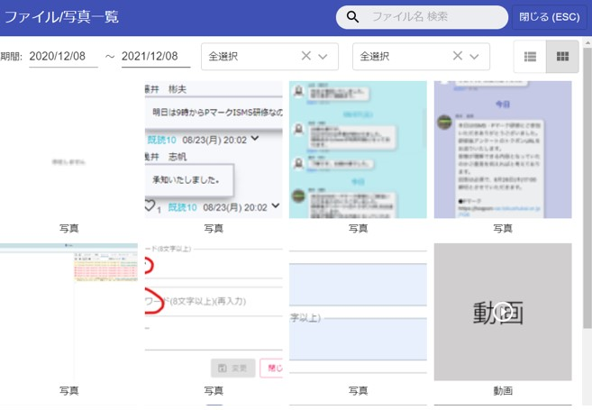

## 通知ON/OFF
コンタクト・グループ毎に、プッシュ通知の発生をON/OFFで変更できます。  
この設定はスマホと共用になるので、ブラウザでOFFにするとスマホもプッシュ通知が発生しない様になります。  
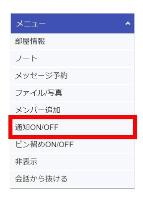

通知OFFにされたコンタクト・グループには、通知OFFアイコンが表示されます。  
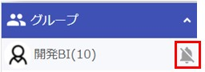

## ピン留めON/OFF
コンタクト・グループ一覧で上位に表示されるようにピン留めON/OFFを変更できます。  
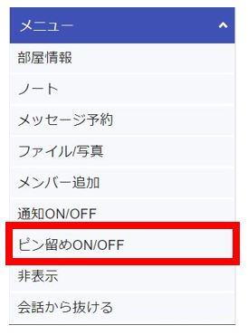

ピン留めされたコンタクト・グループには、ピン留めアイコンが表示されます。
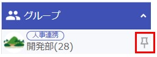

## 会話から抜ける
コンタクト・グループから抜ける事が出来ます。  
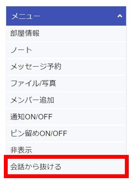