## 文字入力

最大1000文字を入力することができます。

また「Enterで送信」をON/OFFに切り替えることができます。

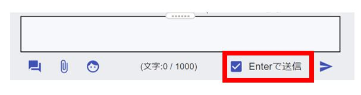  

「Enterで送信」チェックON/OFFでの、改行・送信の対応表
<!--Enter単体だとメッセージ入力欄上では改行されるが送信したメッセージでは改行されずに表示される-->
|              | Enter | Shift+Enter | Ctrl+Enter |
| ------------ | ----- | ----------- | ---------- |
| **Enterで送信をON**  | 送信  | 改行        | 送信       |
| **Enterで送信をOFF** | 改行  | 改行        | 送信       |

---
## ファイル・写真・動画の添付

クリップのアイコンをクリックすると、ファイル選択画面が出てくるので、添付したいファイルを選択します。

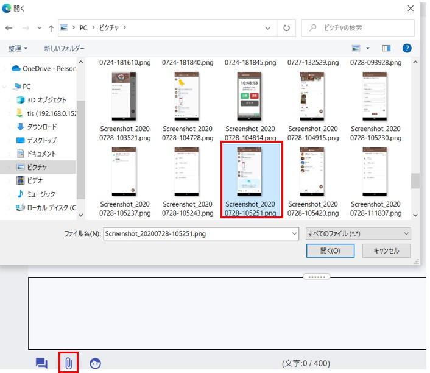
添付するとクリップアイコンにマークが付きます。

その後、送信ボタンを押すとファイルが送信されます。
***
ファイルをドラッグ＆ドロップでも添付できます。

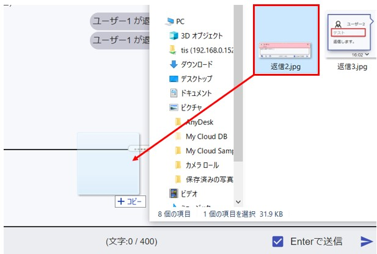
***
スクリーンショットやSnipingToolで切り取った画像を、そのままメッセージ入力欄に張り付けてファイル添付することもできます。

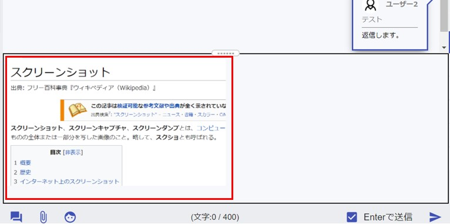
---
## スタンプ

自分で画像を登録して、スタンプとして使用することができます。
顔のアイコンをクリックすると、スタンプ画面が表示されます。

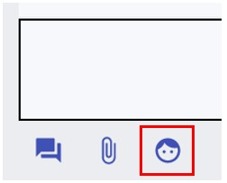

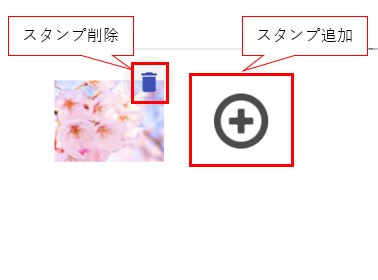
***
**＋**ボタンを押すと、スタンプ追加画面が表示されるので、好きな画像を登録します。  
!!! Tip
    拡張子がpngで背景が透過の画像を登録すると、スタンプらしく登録されます。
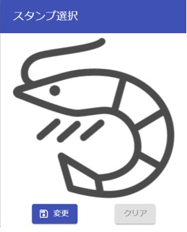
***
相手が送信したスタンプは、自分のスタンプにすることもできます。
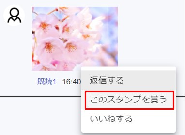
---
## 既読の確認

メッセージを誰かが読むと、メッセージの吹き出しの下に「既読」が表示されます。
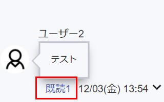

「既読」をクリックすると、そのメッセージの既読・未読状況を確認できます。
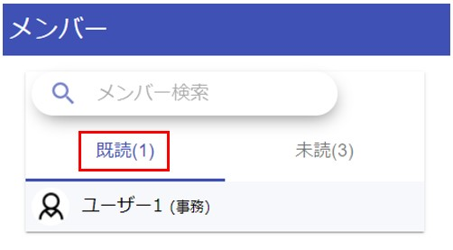
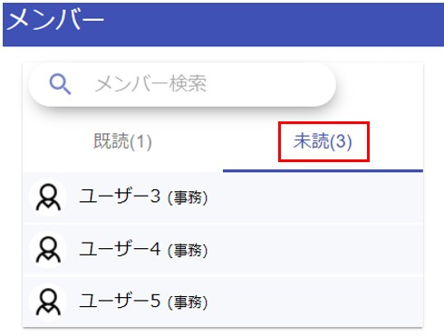
---
## 返信

メッセージの右下の「▽」ボタンをクリックします。
その後、「返信する」をクリックします。
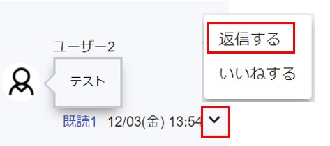
***
テキスト入力欄の上にピンク色で返信元メッセージが表示されると、返信モードとなります。
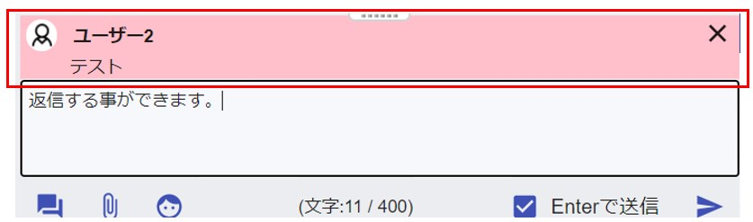
***
返信モードの状態で作成・送信したメッセージは、自分のメッセージの上部に返信元メッセージが添付された状態で表示されます。 

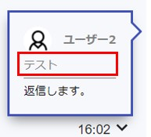

赤枠の返信元メッセージをクリックすると、返信履歴が表示されます。

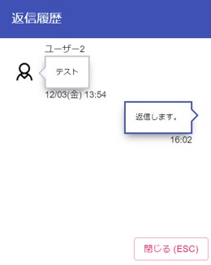
---
## 修正

メッセージの右下の「▽」ボタンをクリックします。
その後、「修正する」をクリックします。
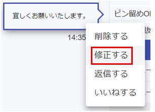

メッセージ修正画面が表示されます。ここで修正したい内容に書き換えます。
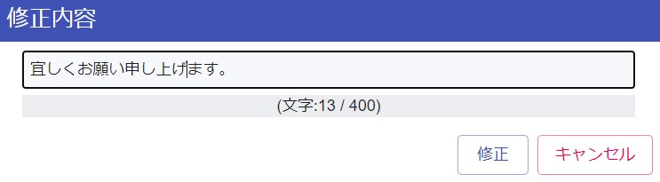

修正したメッセージには「修正あり」のマークが表示されます。 
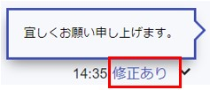

自分のメッセージに対してのみ「修正あり」マークをタップすると、修正前、修正後の内容を見ることができます。 
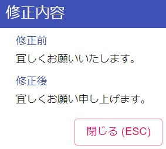
---

## ノート
### 個人ノート
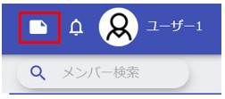  
画面右上のアイコンより個人ノートを起動できます。
自分しか見ることができないノートになっています。  
[スマホ版](sp_chat.md#_8)にもノート機能があり、入力したデータは同期されます。

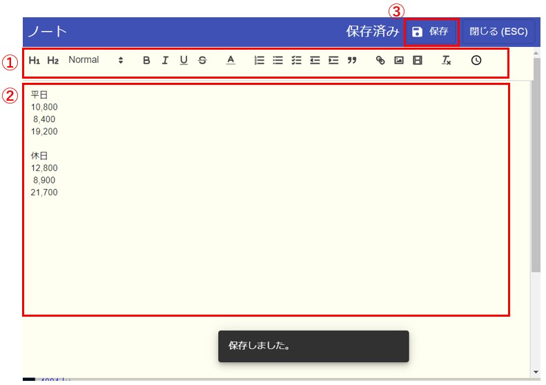
---
### グループノート
それぞれのメンバーとで、ノートを共有できます。
1対1のコンタクトや、多人数のグループにノートが存在します。
そのメンバー内のみ見れるノートになります。  

チャット画面の右のメニューよりノートを選択します。  

グループノートは、自分以外も書き込み・削除を行うことができます。2人以上が同時に編集・保存すると保存日時の遅いデータが反映されます。  
そのため、誤ってどなたかがデータを編集・保存してしまうと、共有してるメンバー全員に影響します。
---
### ノートの用途
個人ノート：TODOリスト　など個人用メモ  
グループノート：グループ内での定例会議のZoomのURL、院内・部署の年間予定・特記事項　などグループでの共有事項  
(いつでもすぐに確認したい事項)  
---
