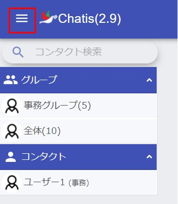
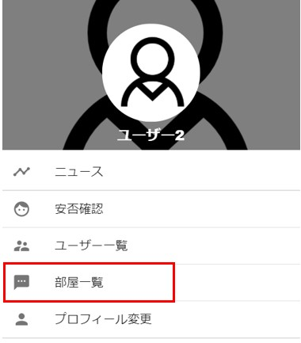
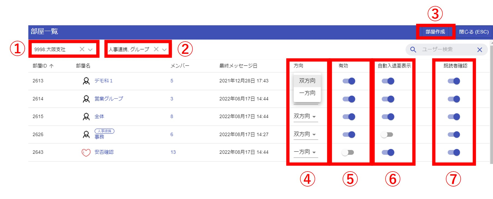
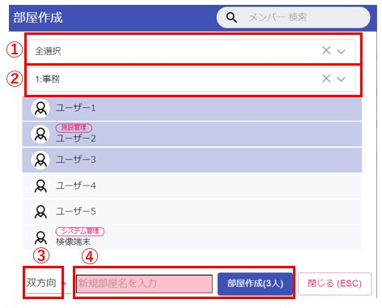

## グループ作成

管理者またはグループ作成権限を持ったユーザーは、複数人からなるグループを作成する事ができます。  
権限が無いユーザーは1体1のコンタクトのみ可能です。
権限を持っているユーザーには、メニューに部屋一覧が表示されます。  

画面左上よりメニューを表示します。  
  

部屋一覧をクリックすると、グループ管理画面が表示されます。
  

<グループ管理画面>  
  

①施設選択：自分が管理できる施設を選べます。基本的には自施設ですが、子施設がある場合は子施設も表示されます。  
②グループ種類：「人事連携」「グループ」が選べます。  
　人事連携：人事システムから自動連携で作成されているグループです。グループ名に青字で「人事連携」と書かれグループです。入退職があった場合は、自動でグループへの入室・退室がされます。  
　グループ：手動で作られたグループです。
③グループ作成画面を起動出来ます。  

<グループ作成画面>  
   
①施設選択：自分が管理できる施設を選べます。基本的には自施設ですが、子施設がある場合は子施設も表示されます。  
②部署選択：①で選択した施設の部署が選べます。選んだ部署でメンバーを絞り込みできます。初期選択は自分の部署です。  
③部屋の種類：「双方向」「一方向」を選択出来ます。基本的には双方向を選択します。特殊なグループを作る場合は一方向を選択します。  
　双方向：グループ内のメンバーなら誰でも発言が出来ます。  
　一方向：グループ内のメンバーで「発言できる人」「発言できない人」を選ぶことができます。  
④グループ名を入力します。何か入力しないとグループが作れないようになっています。  

## メンバー追加

管理者またはグループ作成権限を持ったユーザーは、グループにメンバーを追加する事ができます。  
チャット画面の右のメニューよりメンバー追加を選択します。  
  

## グループ名・写真変更 

現在はスマホ版からのみ、グループ名・写真を変更できます。
