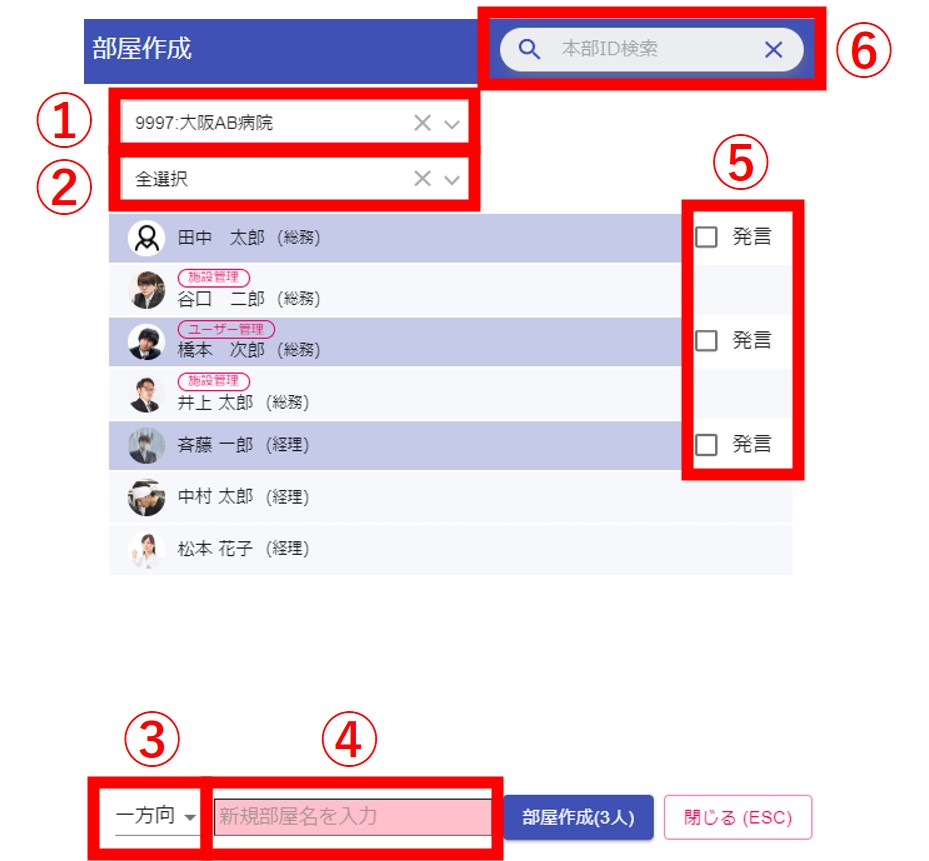

## グループ作成

管理者またはグループ作成権限を持ったユーザーは、複数人からなるグループを作成することができます。  
権限が無いユーザーは1体1のコンタクトのみ可能です。
権限を持っているユーザーには、メニューに部屋一覧が表示されます。  

画面左上のメニューから部屋一覧をクリックすると、グループ管理画面が表示されます。 
  

<!-- 部屋一覧をクリックすると、グループ管理画面が表示されます。
   -->

### グループ管理画面
  

①施設選択：自施設**＋**子施設を選択できます。  

②グループ種類：表示するグループの種類を選択します。  

  -  人事連携：人事システムから自動連携で作成されるグループです。  
　　　　　入退職があった場合は、自動でグループへの入室・退室がされます。  
　　　　　グループ名の上部にに青字で「人事連携」と書かれているグループです。  
　　　　　　
  -  グループ：手動で作られたグループです。

③[グループ作成画面](#_3)を起動できます。  

④方向：グループ内での発言に関する設定ができます。  
　　　　特殊なグループを作る場合は一方向を選択します。  

  -  双方向：グループ内のメンバーなら誰でもメッセージを送信することができます。  

  -  一方向：グループ内のメンバーでメッセージを「送信できるユーザー」「送信できないユーザー」を選択することができます。  

⑤有効：OFFにするとグループ内のメンバー全員に対して部屋を非表示にすることができます。  

⑥自動入退室表示：人事連携システムにより入退職があった場合、チャット内に「○○を追加しました」「○○が退室しました」と表示するかどうかを選択することができます。  

⑦既読者確認：既読者の一覧を表示するかどうかを選択することができます。  

### グループ作成画面 
   

①施設選択：自施設**＋**子施設を選択できます。  

②部署選択：①で選択した施設の部署が選べます。  
　　　　　　選んだ部署でメンバーを絞り込みできます。  
　　　　　　初期選択は自分の部署です。  

③部屋の種類：グループ内での発言に関する設定ができます。  
　　　　　　　特殊なグループを作る場合は一方向を選択します。  

  -  双方向：グループ内のメンバーなら誰でも発言(メッセージを送信)することができます。  

  -  一方向：グループ内のメンバーで「発言できるユーザー」「発言できないユーザー」を⑤で選択することができます。  

④グループ名を入力します。(必須項目)  

⑤グループ内で発言できるユーザーを選択します。(③で「一方向」選択時のみ)  

⑥本部IDでユーザーを検索することができます。  

!!! Tip
    ③、④はグループに追加したいメンバーを2人以上選択(クリック)すると表示されます。

---

## メンバー管理

部屋一覧画面を開いて、グループ数をクリックすることでグループの管理ができます。  
  
