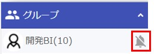

## 全体メニュー  
　　

①[マイルーム](#_2)が表示されます。  

②[重要なお知らせ一覧](notice.md#_2)が表示されます。  

③[安否確認](anpi.md)を見ることができます。   

④[ユーザー一覧](user.md)を見ることができます。  

⑤[部屋一覧](pc_group.md#_2)を見ることができます。   

⑥[プロフィール変更](pc_pro.md)画面へ遷移します。   

⑦利用規約を見ることができます。  

⑧[ヘルプ(マニュアル)](index.md)を見ることができます。  

⑨[ログイン画面](pc_view.md)に戻ります。  

!!! Warning
    ②、④、⑤はそれぞれ権限を持つ[管理者](admin.md#1)のみ表示されます。

---  

---  

## マイルーム
マイルームとは、ログインユーザー本人のみが書き込み・閲覧できる部屋になります。  
TODOリスト・メモ等にご利用ください。  

---  

---  

## チャットメニュー

### 部屋情報  
グループ名・写真を変更できます。   
  
  

---  

### ノート  
[こちら](pc_chat#_12)をご覧ください。  
  

---  

### メッセージ予約  
メッセージを時間指定で送信することができます。  
詳しい説明は[こちら](pc_reserve.md)をご覧ください。  
  

---  

### ファイル/写真  
チャットに送信されたファイル一覧を見ることができます。  
  

①ファイルが送信された期間を選択できます。  

②ファイルの種類を選択できます。  

③送信したメンバーを選択できます。  

④表示形式を「一覧」「サムネイル」から選択できます。
!!! Tip
    「サムネイル」を選択すると写真が検索しやすくなります。  

#### <サムネイル表示>
  

---  

### メンバー追加
[管理者](admin.md#1)またはグループ作成権限を持ったユーザーは、グループにメンバーを追加することができます。  
チャット画面の右のメニューよりメンバー追加を選択します。  
  

---  

### 通知ON/OFF
チャット毎に、プッシュ通知の発生をON/OFFで変更できます。  
!!! Warning
    この設定はスマホ版と共用になるので、ブラウザ版でOFFにするとスマホ版もプッシュ通知が届かなくなります。 

通知OFFにされたチャットには、通知OFFアイコンが表示されます。  
  

---  

### ピン留めON/OFF
コンタクト・グループ一覧で上位に表示されるようにピン留めON/OFFを変更できます。  
  

ピン留めされたコンタクト・グループには、ピン留めアイコンが表示されます。
  

---  

### 非表示
グループを非表示にすることができます。  
!!! Warning
    グループ名の上部に「人事連携」と書かれているグループは非表示にすることができません。
    (人事システム連携で自動的に追加されるため)
  

---  

### 会話から抜ける
コンタクト・グループから抜けることができます。  
