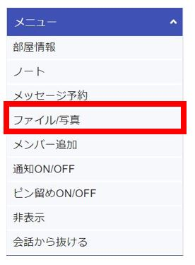
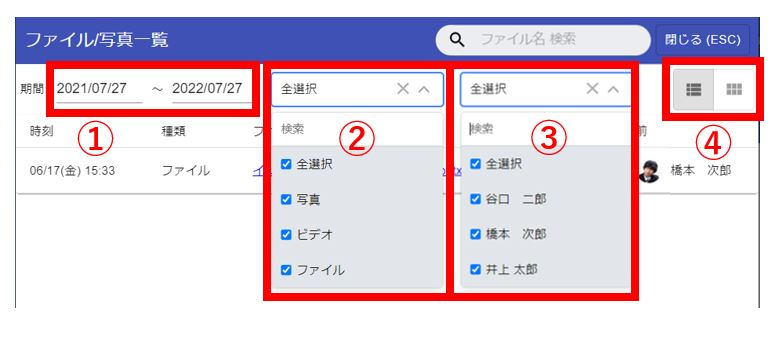
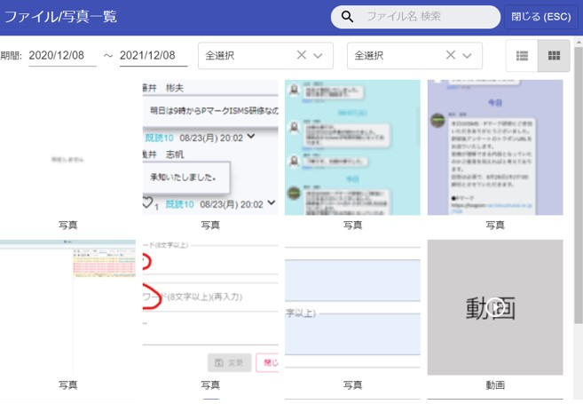
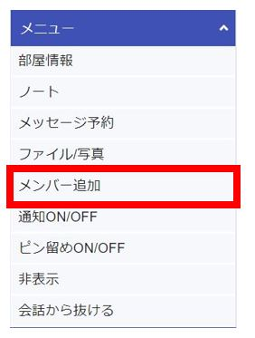
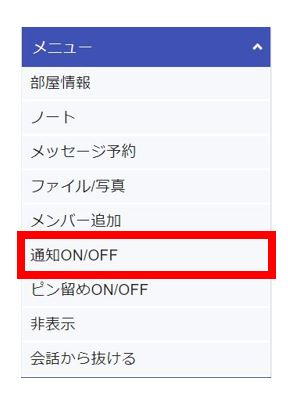
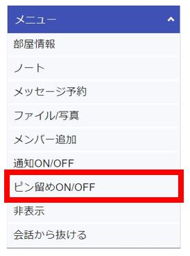
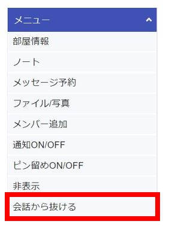

## 全体メニュー  
　　

①[マイルーム]が表示されます。  
②(管理者のみ)[お知らせ管理](notice.md)が表示されます。  
③[安否確認](anpi.md)を見ることができます。   
④(管理者のみ)[ユーザー一覧](user.md)を見ることができます。  
⑤(管理者のみ)部屋一覧を見ることができます。   
⑥[プロフィール変更](pc_pro.md)画面へ遷移します。   
⑦利用規約を見ることができます。  
⑧[ヘルプ(マニュアル)](index.md)を見ることができます。  
⑨[ログイン画面](pc_view.md)に戻ります。  

---  

---  

## チャットメニュー

### 部屋情報  

グループ名・写真を変更できます。   
  
  

---  

### ノート  
[こちら](pc_chat#_12)をご覧ください。  
  

---  

### メッセージ予約  
メッセージを時間指定で送信することができます。  
詳しい説明は[こちら](pc_reserve.md)をご覧ください。  
  

---  

### ファイル/写真  
チャットに送信されたファイル一覧を見ることができます。  

  
チャット画面の右のメニューより「ファイル/写真」を選択すると、ファイル/写真一覧画面が表示されます。  

①ファイルが送信された期間を選択できます。  
②ファイルの種類を選択できます。  
③送信したメンバーを選択できます。  
④表示形式を変更できます。「一覧」「サムネイル」の選択ができます。「サムネイル」を選択すると写真が検索しやすくなります。  

<サムネイル表示>
  

---  

### メンバー追加

管理者またはグループ作成権限を持ったユーザーは、グループにメンバーを追加する事ができます。  
チャット画面の右のメニューよりメンバー追加を選択します。  
  

---  

### 通知ON/OFF
チャット毎に、プッシュ通知の発生をON/OFFで変更できます。  
この設定はスマホ版と共用になるので、ブラウザ版でOFFにするとスマホ版もプッシュ通知が届かなくなります。 

通知OFFにされたチャットには、通知OFFアイコンが表示されます。  
  

---  

### ピン留めON/OFF
コンタクト・グループ一覧で上位に表示されるようにピン留めON/OFFを変更できます。  
  

ピン留めされたコンタクト・グループには、ピン留めアイコンが表示されます。
  

---  

### 非表示
グループを非表示にすることができます。  
人事システム連携で自動的に追加されるグループは非表示にすることができません。
  

---  

### 会話から抜ける
コンタクト・グループから抜けることができます。  
