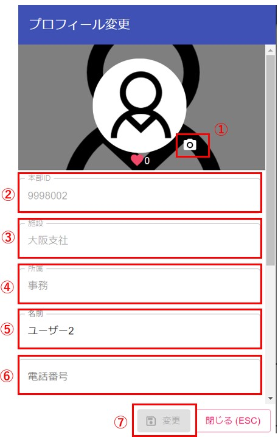

  
　　

以下①～④はほかのユーザーも閲覧できる項目です。    
⑤～⑦はご自身でのみ確認できる項目です。  
また、②～④は変更ができません。  
いずれかの項目を変更すると、画面下部の「変更」ボタンが押せるようになります。  
(赤の「閉じる」ボタンを押すと変更が破棄されますのでご注意ください。)    
  
①画像を変更できます。  

②本部IDが表示されます。  

③施設が表示されます。  

④部署が表示されます。  

⑤名前を変更できます。  
　初回ログイン時は人事システムから取得した名前が表示されます。    

⑥パスワードを変更できます。(2つの欄に同じパスワードを入れる必要があります。)  

⑦テーマカラーを変更できます。  
　変更したテーマはスマホ版にも反映されます。  

⑧安否確認の際に使用するメールを登録できます。  
　スマホをお持ちの無い方は、こちらにガラケーのメールアドレスを登録すると、安否確認のURLが記載したメールが送信されます。  

