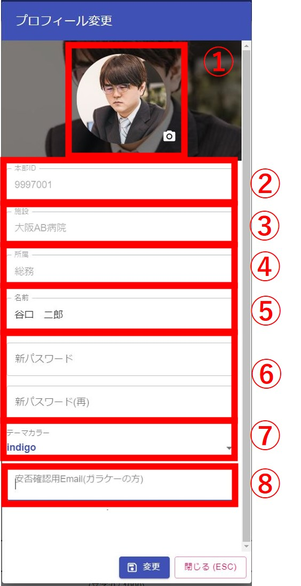

画面左上よりメニューを表示します。  
  

プロフィール変更画面が起動します。  
  
①画像を変更できます。他の人からも見えます。  
②本部IDが表示されます。ここは変更できません。他の人からも見えます。  
③施設が表示されます。ここは変更できません。他の人からも見えます。  
④部署が表示されます。ここは変更できません。他の人からも見えます。  
⑤名前を変更できます。初期値は人事システムから取得した名前です。他の人からも見えます。  
⑥電話番号を変更できます。他の人からも見えます。  
⑦何か値を変更した場合に押せるようになります。変更ボタンを押すと各種入力した内容でプロフィールが変更します。  

<続き>  
  
⑧パスワードを変更できます。2つの欄に同じ値を入れる必要があります。他の人からは見えません。  
⑨テーマカラーを変更できます。変更したテーマはスマホ版にも反映されます。他の人からは見えません。  
⑩安否確認の際に使用するメールを登録できます。スマホをお持ちの無い方は、こちらにメールアドレスを登録すると、安否確認のURLが記載したメールが送信されます。他の人からは見えません。  
⑪iOSのスマホアプリインストールに必要なQRコードが表示されます。個人毎にQRコードが異なります。  
⑫Androidのスマホアプリインストールに必要なQRコードが表示されます。全ユーザー同じQRコードです。  
