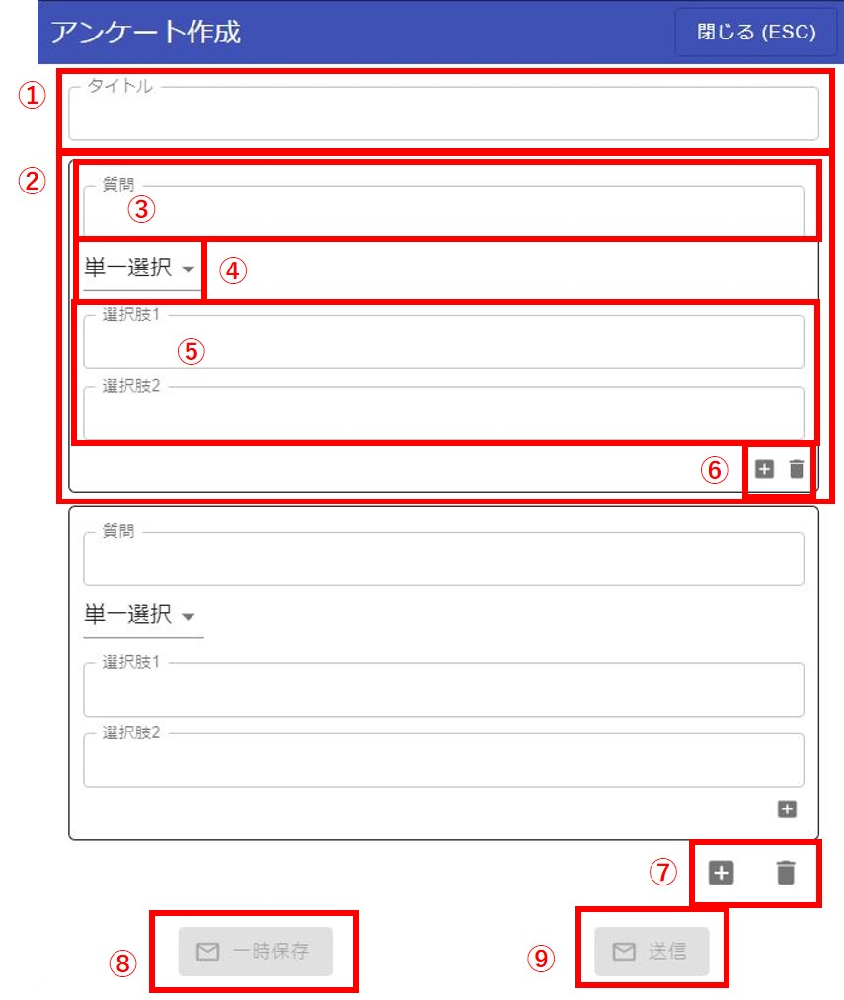
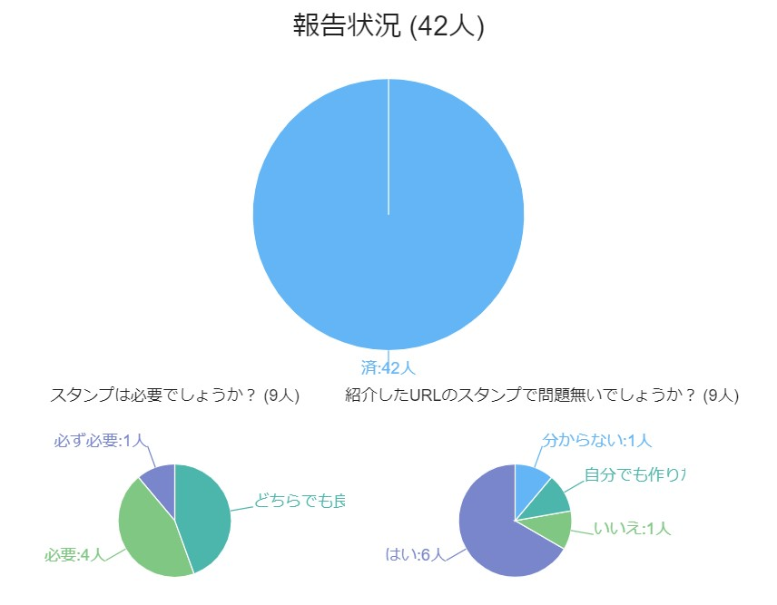
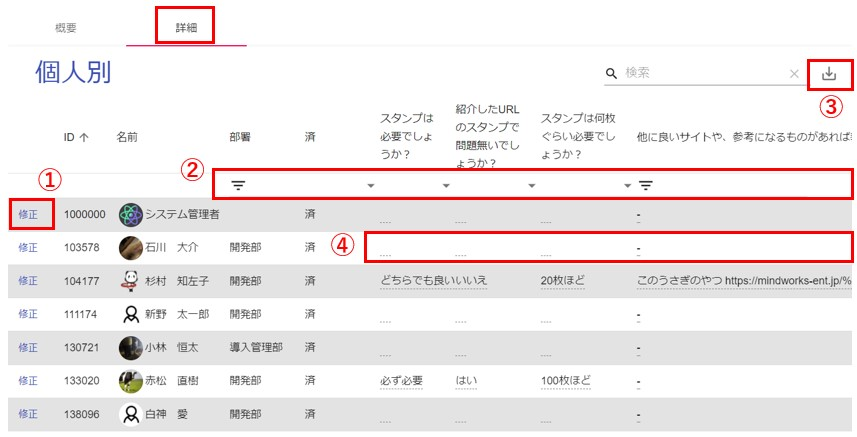

## アンケート

グループ毎にアンケートをすることができます。

テキスト入力欄の左下からアンケート画面を開くことができます。

---
### アンケート作成

新規作成する場合は「アンケート作成」ボタンをクリックします。

アンケート作成画面の説明です。  
①アンケートのタイトルを入力します。  
②1つの質問内容の塊となります。質問を増やす場合は⑦を押すと増やすことができます。  
③質問のタイトルになります。  
④質問の種類になります。「選択肢」と「自由入力」が選択できます。「選択肢」を選択した場合は⑤の質問選択肢を入力することができます。
「自由入力」を選択した場合は、⑤は入力しなくても良くなります。  
⑤質問選択肢を入力することができます。アンケートを答えるユーザーには選択肢がボタンとして表示されます。  
⑥質問選択肢を増やすことができます。最大10個まで増やせます。  
⑦質問自体を増やすことができます。最大10個まで増やせます。  
⑧アンケート内容を一時保存することができます。  
⑨アンケートをグループに送信します。グループのメンバーにはプッシュ通知が送信されます。  
---
### 一覧表示

アンケートの内容を見ることができます
「実施中」「終了」のアンケートをクリックすると「概要」「詳細」のタブが出てきます。

<概要タブ>  

①グループ内のメンバーの合計数です。クリックするとそのメンバーのグラフが表示されます。  
②アンケートを答えたメンバーの数です。クリックするとそのメンバーのグラフが表示されます。  
③アンケートを答えていないメンバーの数です。クリックするとそのメンバーのグラフが表示されます。  
グラフは以下のイメージです。  

グラフをクリックすると、クリックした場所に応じて、メンバー一覧が表示されます。  
↓例は、「はい」をクリックした時に表示されるメンバー一覧です。  

---
<詳細タブ>  

①代理入力ができます。  
②一覧の絞り込みができます。（例：「はい」と答えた人だけを絞り込み等）  
③CSV出力ができます。画面で絞り込みを行っている場合は、絞り込んだ状態で出力されます。  
④各項目毎に対しても、代理入力ができます。