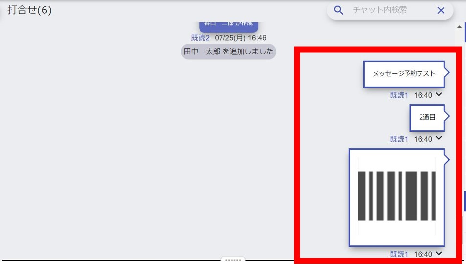

## メッセージ予約 
「作成」を選択します。  
<!--    -->

---  

<!--    -->

①送信したい日時を選択します。  

②メッセージを入力します。  

③ファイル・スタンプを選択します。  

④メッセージ・ファイル等を仮送信します。
  
---  

通常のチャットのように、複数送ることができます。  
予約したいメッセージを全て仮送信したら保存を押してください。  
<!--   -->

---  

これでメッセージ予約が完了です。  
<!--   -->

---  

予約した時間になると自動的にメッセージが送信されます。  
 