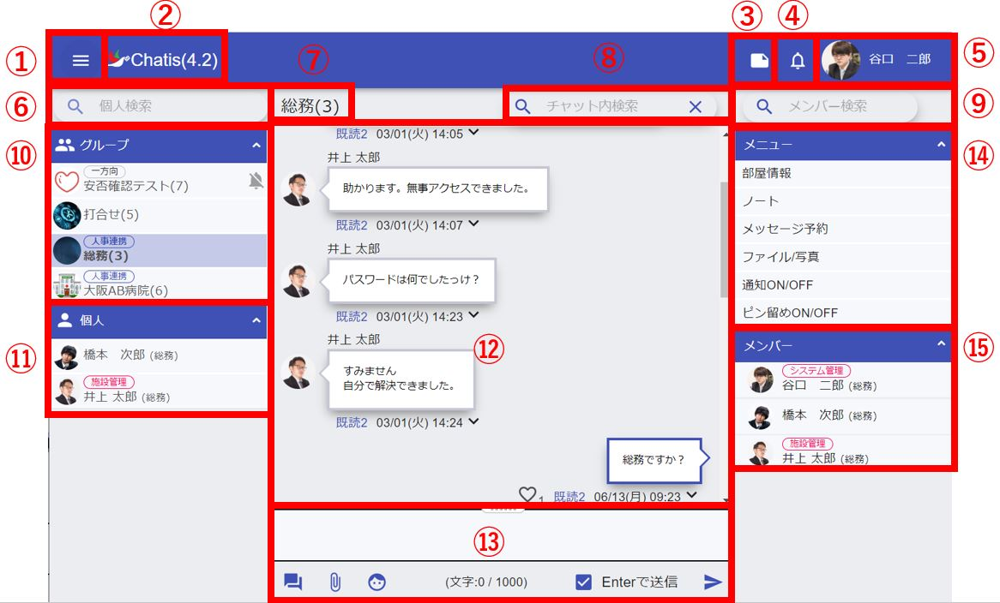

## ログイン画面
  

①自身の本部IDを入力します。  
②自身のパスワードを入力します。  
　パスワードを忘れた場合は[こちら](password.md)をご覧ください。  

## メイン画面
<!--5.0に伴って要画面差し替え-->
  
<!-- ユーザーによってメニューに表示される内容が異なります。(例:管理者の場合はユーザー一覧画面のリンクが表示される)   -->
①[メニュー](pc_menu.md)を開くことができます。  
②Chatisのバージョンが表示されます。  
　アップデートされるとこのバージョンも更新されます。  
③[個人ノート](pc_chat.md#_14)が起動します。  
　ノートはブラウザ版とスマホ版で同期されます。  
④[お知らせ]を見ることができます。  
⑤自身のアイコンと名前が表示されます。  
　クリックするとメニューが表示されて、プロフィール変更やログオフができます。  
⑥グループに所属しているメンバーを検索できます。  
 （例:「田中」と入力すると「田中」さんが所属するグループが表示されます。）  
⑦画面に表示しているグループ名・個人名が表示されます。  
⑧文字を入力してENTERキーまたは虫眼鏡ボタンを押すと、過去のメッセージ履歴から検索する[メッセージ検索画面](#_3_)が表示されます。  
⑨現在表示しているグループのメンバーを氏名や部署名で絞り込むことができます。  
（例:「総務」と入力すると「総務」のメンバーに絞り込みます）  
⑩ご自身が所属しているグループ一覧が表示されます。  
⑪ご自身と個人間でチャットをしているメンバー一覧が表示されます。  
⑫メッセージ履歴が表示されます。  
⑬チャット欄になります。各操作は[こちら](pc_chat.md)をご参照ください。  
⑭現在表示しているグループ・個人間チャットの[メニュー](pc_menu.md)が表示されます。  
　権限によって表示が異なります。（例:管理者は「メンバー追加」ボタンが追加されます）  
⑮現在表示しているグループ・個人間チャットのメンバー一覧が表示されます。  
　メンバーをクリックしてコンタクト開始ボタンを押す事で、そのメンバーと個人間でチャットができます。  
<!--ここもスクショが欲しい-->

## メッセージ検索画面
過去のメッセージを検索できます。検索されたメッセージをクリックすると、メッセージ履歴画面に遷移します。  
×ボタンをクリックすると、元の画面に戻ります。   
 
<!--    -->

## メッセージ履歴画面
検索したメッセージが表示されます。  
  
①検索したメッセージから前5件を取得します。  
②検索したメッセージから後ろ5件を取得します。  
