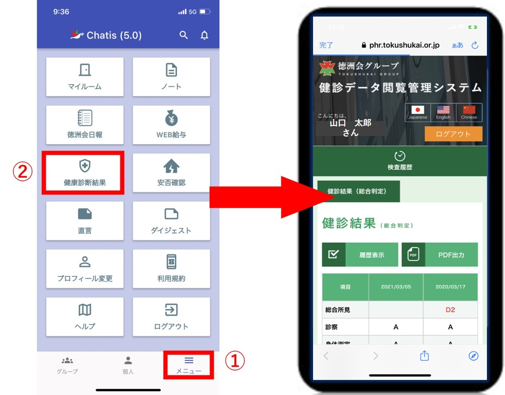
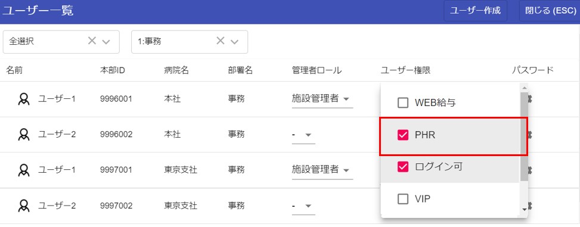

# 健康診断結果

## 機能

### メニューから健康診断結果を起動
  

## 利用方法
健康診断結果を利用開始する方法は2パターンあります。  

### ①アカウント認証での利用開始
[アカウント認証](sms.md)をすることによって自動的に利用開始できます。  

### ②管理者による利用開始
ユーザー一覧画面を表示できる[管理者](admin.md)によって、「PHR」にチェックを入れてもらった場合に利用開始できます。  
  