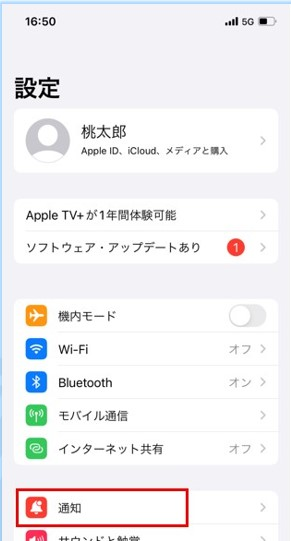
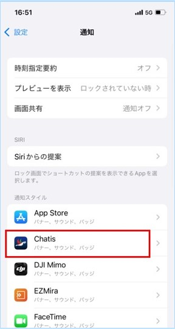
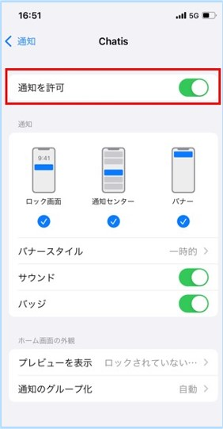
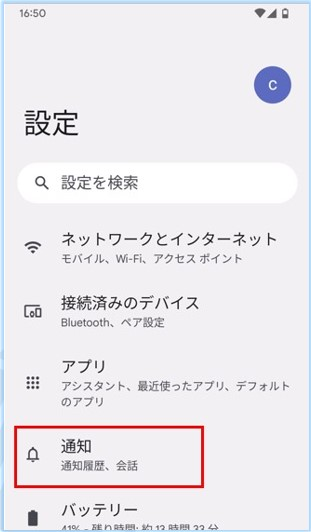
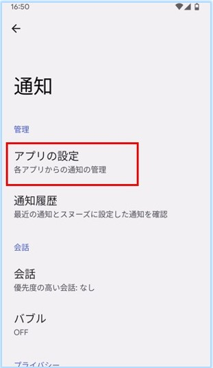
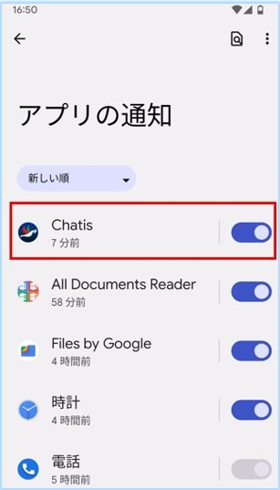

## スマホの設定で通知OFFにしている

スマホの設定より、Chatisのプッシュ通知ON/OFFができます。
Chatisインストール時に、プッシュ通知ON/OFFを設定する画面が出てきますが、そこでOFFを選択していると、Chatisのプッシュ通知がスマホに届きません。
プッシュ通知が届かない場合は、以下よりスマホの設定をご確認ください。

### iOS

  

  

  

### Android

  

  

  

## Chatis内で特定のグループ・個人間チャットの通知をOFFにしている

通知OFFにされたグループ・個人間チャットには、通知OFFアイコンが表示されます。  
そのグループ・個人間チャットに対しては、プッシュ通知が届きません。  
プッシュ通知が必要な場合は、通知ONに戻してください。  

## 複数のスマートフォン端末でログインしている場合

1つのログインID(アカウント)を複数のスマートフォン端末で使用している場合は、古いスマートフォンにはプッシュ通知が届きません。  
セキュリティの観点からも、1つのログインIDに対して、1台のスマートフォン端末でのご利用を推奨しています。  
ブラウザ版はそのような制限はありません。