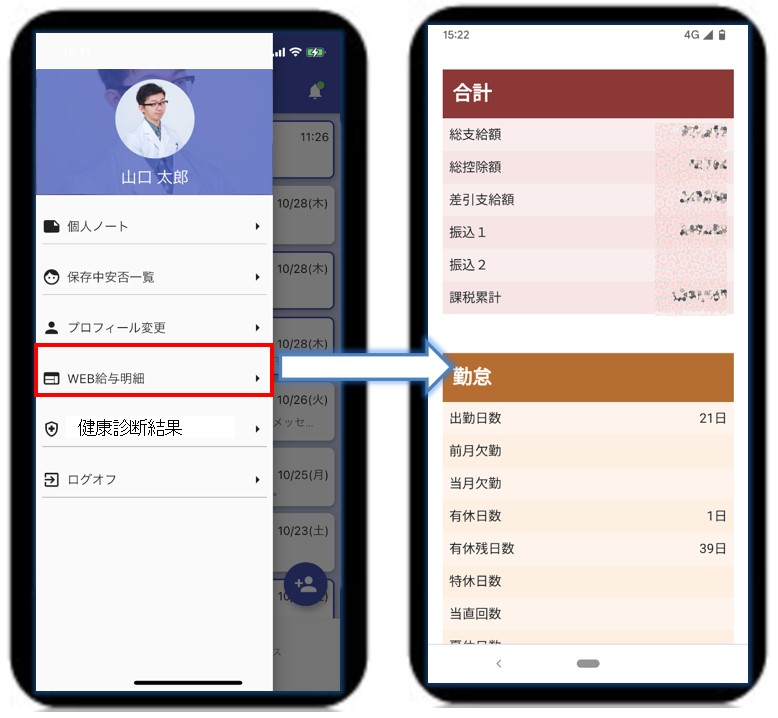
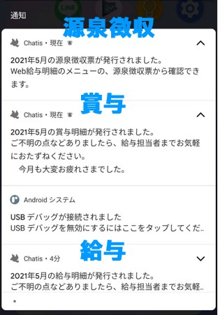
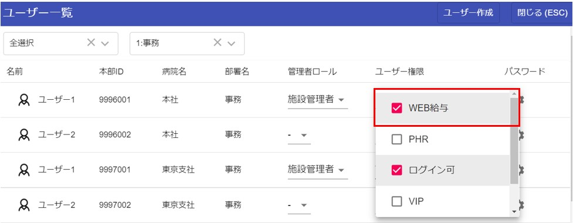

# WEB給与連携

## 機能

### メニューからWEB給与を起動
  
### 各日にプッシュ通知
  

## 利用方法
WEB給与を利用開始する方法は2パターンあります。  

### ①アカウント認証での利用開始
[アカウント認証](sms.md)をする事によって自動的に利用開始できます。  

### ②管理者による利用開始
ユーザー一覧画面を表示できる[管理者](admin.md)によって、「WEB給与」にチェックを入れてもらった場合に利用開始できます。  
  

