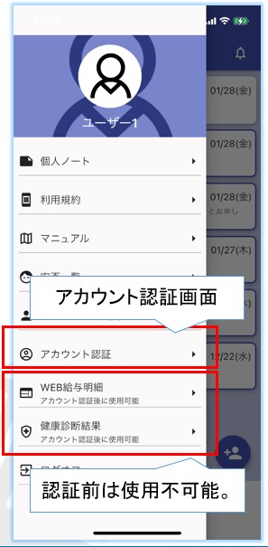
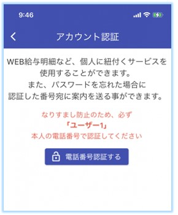
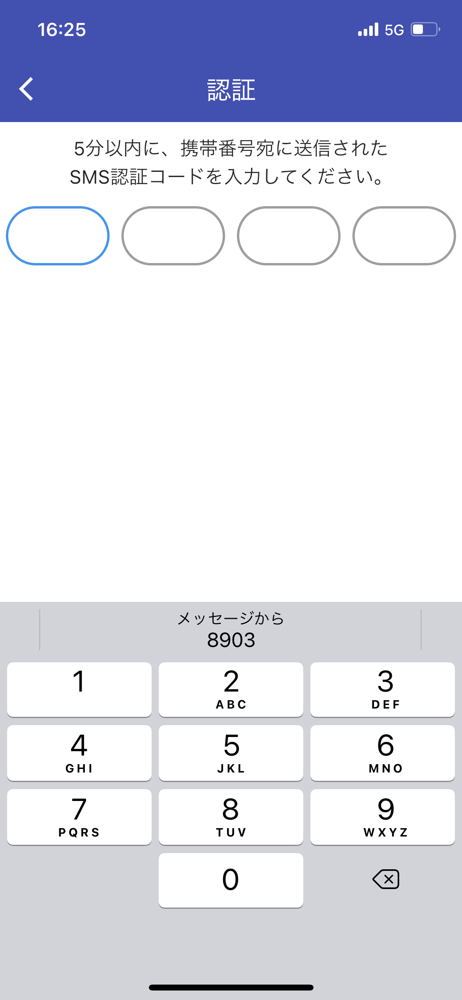
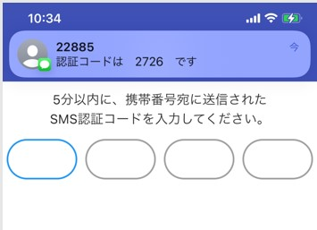
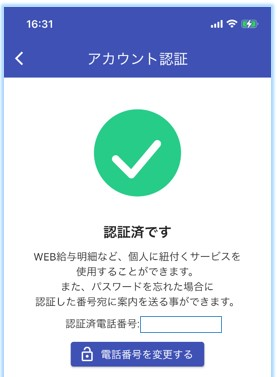

# アカウント認証

以下の機能を利用するためにはSMS(ショートメッセージ)認証が必要です。  

- [WEB給与明細](salary.md)連携  
- [職員健康診断結果](phr.md)連携  
- ご自身での[パスワード初期化](password.md#1)  

!!! Warning
    2022年7月29日以降にChatisをインストールしたユーザー様は初回設定時にSMS認証をするため、以下の操作は不要です。

2022年7月28日以前にChatisをインストールしたユーザー様は、メニュー(①)の「WEB給与」もしくは「健康診断結果」(②)を初めてタップすると電話番号を入力する画面に遷移するので、ご自身の携帯電話番号を入力して「送信」を押してください。  
  

<!--    -->

入力した電話番号当てにSMS(ショートメッセージ)が届きます。  
SMSが届かない場合は[こちら](whysms.md)を確認下さい。  
  
<!--    -->

電話番号の入力が完了すると、認証番号入力画面に遷移しますので、SMSに送信された番号を入力します。  
  
<!--    -->

認証に成功すると、[WEB給与](salary.md)や[職員健康診断結果](phr.md)がChatisから閲覧できます。  
認証に失敗した場合は、再度認証番号を入力してください。  
<!--    -->
