## 文字入力

最大1000文字を入力することができます。  
入力欄は最大5行分まで広がります。  
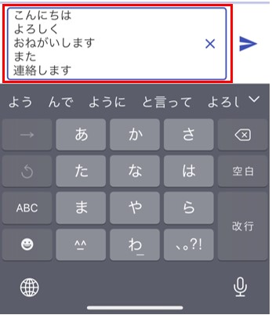  

---

## 写真・カメラ・動画の添付

**＋**ボタンを押した後、ライブラリ・カメラ・ビデオを選んで送信することができます。

  

初回のみ、アクセスの許可を促す画面が出てくるので、「OK」「すべての写真へのアクセスを許可」等を選択してください。  <!--androidの場合の画像もあると親切-->  
!!! Note
    スマホ版Chatisでは、Chatisでスマホ本体の機能(カメラ・写真一覧・プッシュ通知)を利用する際に初回のみに必ずアクセスの許可を促す画面が出てきます。 

ライブラリ・カメラ・ビデオを押しても画面が変化しないときは[こちら](sp_permission.md)をご覧ください。

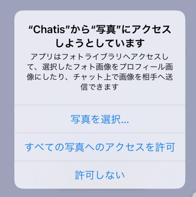  

写真一覧が表示されるので、送りたい画像を選択します。  

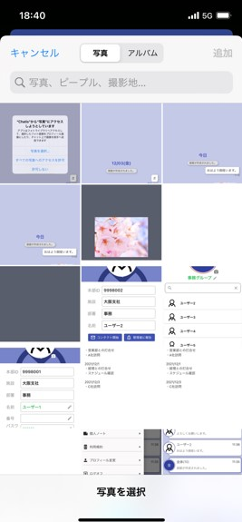  

---
## スタンプ
<!--著作権の注意-->
ご自身で画像を登録してスタンプとして使用することができます。  
顔のアイコンをタップすると、スタンプ画面が表示されます。

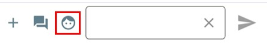  

### <スタンプ画面>  
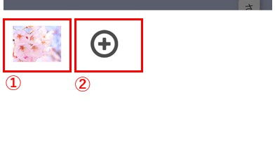  
①すでに登録しているスタンプ。  
　複数登録している場合は、登録されたもの全てが表示されます。  

②スタンプを登録・削除する画面を起動できます。

### <スタンプ登録・削除画面>  
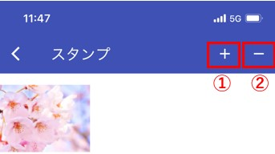  

①スマホ内の写真一覧から新しいスタンプを登録できます。  

②既に登録しているスタンプを、選択して削除することができます。  

---
## 既読の確認

メッセージを誰かが読むと、メッセージの吹き出しの下に「既読」が表示されます。
  

「既読」をタップすると、そのメッセージの既読・未読状況を確認できます。
  

①既読一覧を表示します。

②未読一覧を表示します。

---
## 返信

相手のメッセージを長押しして指を離すとメニュー画面が表示されます。  
返信を選択します。  
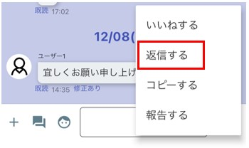  
***
テキスト入力欄の上に返信元メッセージが表示されると、返信モードとなります。  
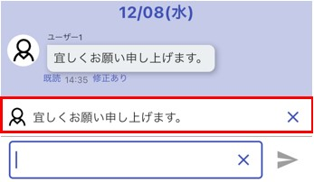  
***
<!--口語になっている-->
返信モードの状態で作成・送信したメッセージは、自分のメッセージの上部に返信元メッセージが添付された状態で表示されます。  
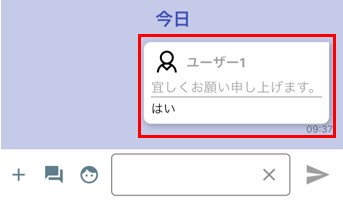  

返信メッセージをタップすると、返信履歴画面が表示されます。  
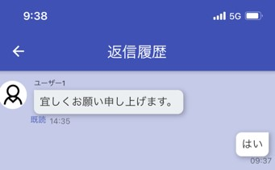  
---
## 修正

自分のメッセージを長押しして指を離すとメニュー画面が表示されます。  
修正を選択します。  
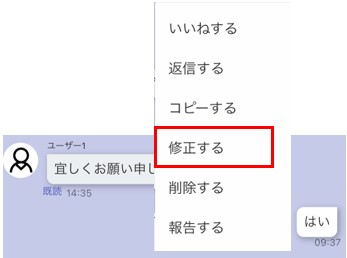  

メッセージ修正画面が表示されます。ここで修正したい内容に書き換えます。  
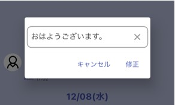  

修正したメッセージには「修正あり」のマークが表示されます。  
自分のメッセージに対してのみ「修正あり」マークをタップすると、修正前・修正後の内容を見ることができます。  
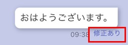  
---

## ノート
### 個人ノート
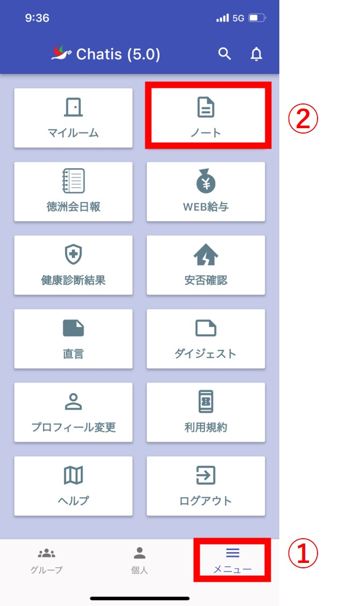  
メイン画面下のタブ「メニュー」を押した後(①)、画面右上のノートを押す(②)と起動します。  
ユーザー本人しか見ることができないノートになっています。  
[ブラウザ版](pc_chat.md#_10)にもノート機能があり、入力したデータは同期されます。   

#### <ノート画面>  
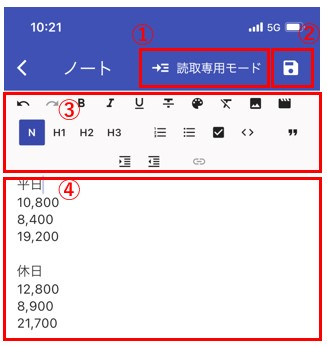  
①「読み取り」「書き込み」モードを選べます。  
　起動時は「読み取り」になっています。  

②ノートを保存できます。  

③文字を修飾(大きくしたり、色をつけたり、箇条書きにしたり)できます。  

④ノート本体です。「書き込み」モードの時はこちらに入力できます。  

#### <ノート画面　書き込みモード>
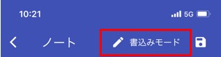  
---
### グループノート
グループのメンバー内でノートを共有できます。  
1対1のコンタクトや、多人数のグループにノートが存在します。  
そのメンバー内のみ見れるノートになります。  

チャット画面の右のメニューよりノートを選択します。  
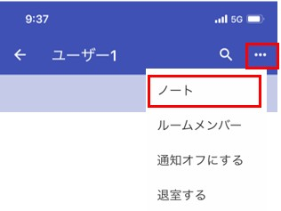

グループノートは、自分以外も書き込み・削除を行うことができます。  
2人以上が同時に編集・保存すると保存日時の遅いデータが反映されます。  
そのため、誤ってどなたかがデータを編集・保存してしまうと、共有してるメンバー全員に影響します。  
---
### ノートの用途

- 個人ノート：TODOリスト　など  
- グループノート：グループ内での定例会議のZoomのURL、部署の年間予定　など  

---
