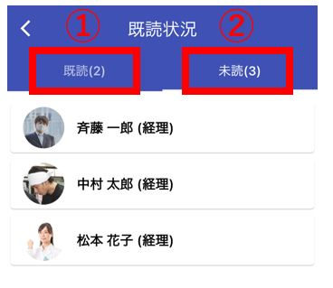
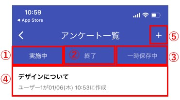
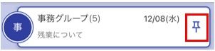

## 文字入力

最大400文字を入力する事が出来ます。  
入力欄は最大5行分まで広がります。  
  

---

## 写真・カメラ・動画

  

「＋」ボタンを押して、写真・カメラ・動画を選んで送信する事が出来ます。

  

初回のみ、アクセスの許可画面が出てくるので、許可してください。
※スマホアプリでは、スマホ本体の機能(カメラ・写真一覧・プッシュ通知)にアクセスする際に必ず、アクセス許可画面が出てきます。許可しない場合は、スマホアプリからそれらにアクセスできない様になっています。  

  
写真一覧が表示されるので、送りたい画像を選択します。

## スタンプ

自分で画像を登録して、スタンプとして使用する事が出来ます。
顔のアイコンをクリックすると、スタンプ画面が表示されます。

  

<スタンプ画面>  
  
①すでに登録しているスタンプ。複数登録している場合は、登録された分表示されます。
②スタンプを登録・削除する画面を起動できます。

<スタンプ登録・削除画面>  
  
①スマホ内の写真一覧から新しいスタンプを登録できます。  
②既に登録しているスタンプを、選択して削除する事ができます。  

## 既読の確認

メッセージが既読になると、既読文字が表示されます。
  

既読文字をクリックすると、そのメッセージの既読・未読状況を確認できます。
  
①既読一覧を表示します。
②未読一覧を表示します。

## 返事

相手のメッセージを長押ししてメニュー画面を表示します。  
返信を選択します。  
  

テキスト入力欄の上に、相手のメッセージが表示される様になれば、返信モードとなります。  
  

返信したメッセージは、自分のメッセージ内容と返信元のメッセージ内容がくっついた状態で表示されます。  
  

返信メッセージをクリックすると、返信履歴画面が表示されます。
  

## 修正

自分のメッセージを長押ししてメニュー画面を表示します。  
修正を選択します。  
  

メッセージ修正画面が表示されます。ここで修正したい内容に書き換えます。  
  

修正したメッセージには「修正あり」のマークが表示されます。  
自分のメッセージのみ「修正あり」マークをクリックすると、修正前、修正後の内容を見ることが出来ます。  
  

## アンケート

スマホ版では、アンケートの回答のみ行えます。  
アンケートの作成はブラウザ版のみ対応しています。  

  
①クリックするとアンケート回答画面が起動します。  
②アンケート一覧画面が起動します。未回答のアンケートが存在する場合は、未回答バッジがつきます。

<アンケート回答画面>  
  
質問に答えて、「送信」ボタンをクリックする事で回答済みになります。  
回答する事で、未回答バッジが消えます。  

<アンケート一覧画面>  
  
今まで実施されたアンケートを見ることが出来ます。  
アンケートをクリックする事で、そのアンケートに回答出来ます。  

---
## ノート
### 個人ノート
  
メイン画面左上のアイコンよりメニューを出します。  

  
メニューより個人ノートを起動します。  
自分しか見ることができないノートになっています。  
ブラウザ版にもノート機能があり、入力したデータは同期されます。  

<ノート画面>  
  
①「読み取り」「書き込み」モードを選べます。起動時は「読み取り」になっています。  
②ノートを保存できます。  
③文字を修飾(大きくしたり、色をつけたり、箇条書きにしたり)できます。  
④ノート本体です。「書き込み」モードの時はこちらに入力できます。  

<ノート画面　書き込みモード>  
  
---
### 共有ノート
それぞれのメンバーとで、ノートを共有できます。
1対1のコンタクトや、多人数のグループにノートが存在します。
そのメンバー内のみ見れるノートになります。  

チャット画面の右のメニューよりノートを選択します。  

共有ノートは、自分以外も書き込み・削除を行う事ができます。保存されるデータは後勝ちとなります。
そのため、間違って誰かがデータを消してしまうと、共有してるメンバー全てに影響が発生します。

## 通知ON/OFF
コンタクト・グループ毎に、プッシュ通知の発生をON/OFFで変更できます。  
この設定はブラウザ版と共用になるので、スマホでOFFにするとブラウザもプッシュ通知が発生しない様になります。  

通知OFFにされたコンタクト・グループには、通知OFFアイコンが表示されます。  

## ピン留めON/OFF
コンタクト・グループ一覧で上位に表示されるようにピン留めON/OFFを変更できます。  
コンタクト・グループを長押しするとメニューが起動します。
  

ピン留めされたコンタクト・グループには、ピン留めアイコンが表示されます。
  

## 会話から抜ける
コンタクト・グループから抜ける事が出来ます。  
