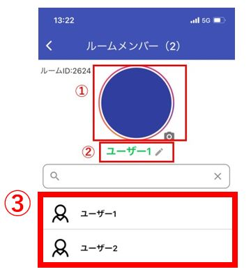

## グループ作成

管理者またはグループ作成権限を持ったユーザーは、複数人からなるグループを作成する事ができます。  
権限が無いユーザーは1体1のコンタクトのみ可能です。
権限を持っているユーザーには、グループ作成アイコンが表示されます。  

  

アイコンをクリックすると、グループ作成画面が表示されます。
  

## メンバー追加

管理者またはグループ作成権限を持ったユーザーは、グループにユーザーを追加する事ができます。  

  

## グループ名・写真変更 

現在はスマホ版からのみ、グループ名・写真を変更できます。

チャット画面の右のメニューよりルームメンバーを選択して、ルームメンバー画面を表示します。  
  

<ルームメンバー画面>  
  
①グループの写真を変更できます。  
②グループ名を変更できます。
