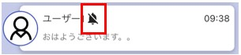

## 長押しメニュー  
[グループ](sp_view.md#_2)・[個人間チャット](sp_view.md#_3)一覧画面で任意のチャットを長押しすると表示されます。  
  
---  

### 退室する
チャットのメンバーから抜けることができます。

---  

### 通知オフにする/ 通知オンにする
設定したチャットでメッセージが送信されても通知が届かなくなります。  
再度通知オンにしたい場合は「通知オンにする」を選択してください。    
!!! Warning
    この設定はブラウザ版と共用になるので、スマホ版でOFFにするとブラウザ版でも通知が届かなくなります。  

通知OFFにされたコンタクト・グループには、通知OFFアイコンが表示されます。  

---
### ピン留めする /ピンを外す
設定したチャットを常に一覧の上部に固定させることができます。  
!!! Tip
    よく利用するチャットでご利用ください。    

ピン留めされたコンタクト・グループには、ピン留めアイコンが表示されます。
  
---
### 非表示にする  
設定したチャットを非表示にします。  
!!! Warning
    チャットのメンバーからは抜けません。    

---  

---  

## チャット画面でのメニュー  
チャット画面の右上の「・・・」ボタンからメニューを表示することができます。  

<!--  -->
---  

### ノート  
[こちら](pc_chat#_12)をご覧ください。  

<!--  -->

---
### ユーザー追加
<!--ユーザー追加とメンバー追加で表記ゆれしている？-->
管理者またはグループ作成権限を持ったユーザーは、グループにユーザーを追加することができます。  
  
<!--  -->

---

### ルームメンバー

ルームメンバー画面を表示します。  
  
<!--  -->

#### <ルームメンバー画面>  
  

①グループの写真を変更できます。  

②グループ名を変更できます。  

③ユーザーを選択して個人間チャットをはじめることができます。   

---  

### 通知オフにする/ 通知オンにする
チャット毎に、プッシュ通知の有無をON/OFFで変更できます。  
この設定はブラウザ版と共用になるので、スマホ版でOFFにするとブラウザ版でもプッシュ通知が届かなくなります。  
 
<!--  -->

通知OFFにされたチャットには、通知OFFアイコンが表示されます。  

---  

### 退室する
コンタクト・グループから抜けることができます。
  
  
<!--  -->

---  

### 非表示にする
グループを一覧から非表示にすることができます。  
人事システム連携で自動的に追加されるグループは非表示にすることができません。  
  
<!--  -->