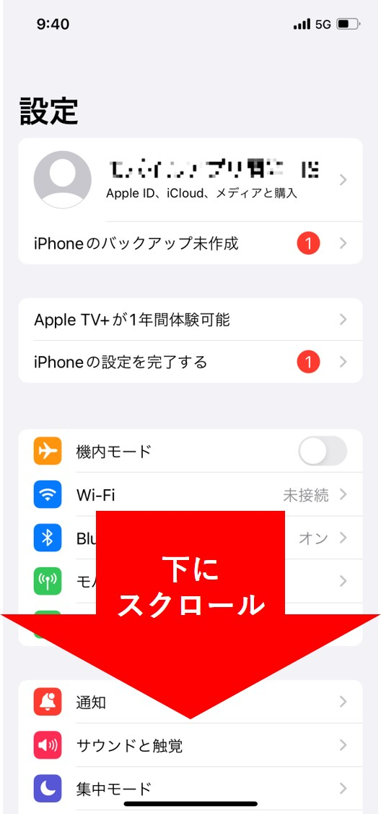

## スマホの設定で写真・カメラのアクセスを許可していない

スマホの設定より、写真・カメラのアクセス許可を設定できます。
Chatisインストール後、初めて以下のいずれの操作をしたときに表示されるアクセスの許可を促す画面で「許可しない」を選択すると、Chatisでカメラの機能が使えません。

- チャット画面で「カメラ」を選択したとき
- ログイン画面で「QRコードでログイン」を選択したとき  

また、初めてチャット画面で「ライブラリ」もしくは「ビデオ」を選択したとき に表示されるアクセスの許可を促す画面で「許可しない」を選択すると、Chatisで写真やビデオを送信できません。

写真・カメラのアクセスを許可する場合は、以下よりスマホの設定をご確認ください。  

### iOS版

①スマホのホーム画面から「設定」アプリを選択して、下にスクロールするとインストールしているアプリの一覧が表示されます。  

<!--   -->
  

②一覧の中から「Chatis」を選択します。  
(アプリはアプリ名のアルファベット順に並んでいます。「Chatis」が見つからない場合は、「C」付近を探してください。)

 

③写真・ビデオを利用したい場合は「写真」を選択した後「すべての写真」もしくは「選択した写真」を選択してください。
カメラを利用したい場合は「カメラ」をONにしてください。

 