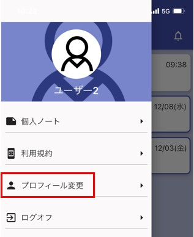
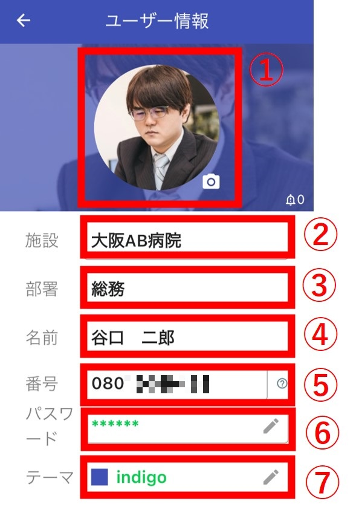

画面左上よりメニューを表示して、プロフィール変更をクリックします。  
  

プロフィール変更画面が起動します。  
  
①画像を変更できます。他の人からも見えます。  
②本部IDが表示されます。ここは変更できません。他の人からも見えます。  
③施設が表示されます。ここは変更できません。他の人からも見えます。  
④部署が表示されます。ここは変更できません。他の人からも見えます。  
⑤名前を変更できます。初期値は人事システムから取得した名前です。他の人からも見えます。  
⑥電話番号を変更できます。他の人からも見えます。  
⑦パスワードを変更できます。2つの欄に同じ値を入れる必要があります。他の人からは見えません。  押すと各種入力した内容でプロフィールが変更します。  
⑧テーマカラーを変更できます。変更したテーマはブラウザ版にも反映されます。他の人からは見えません。  
