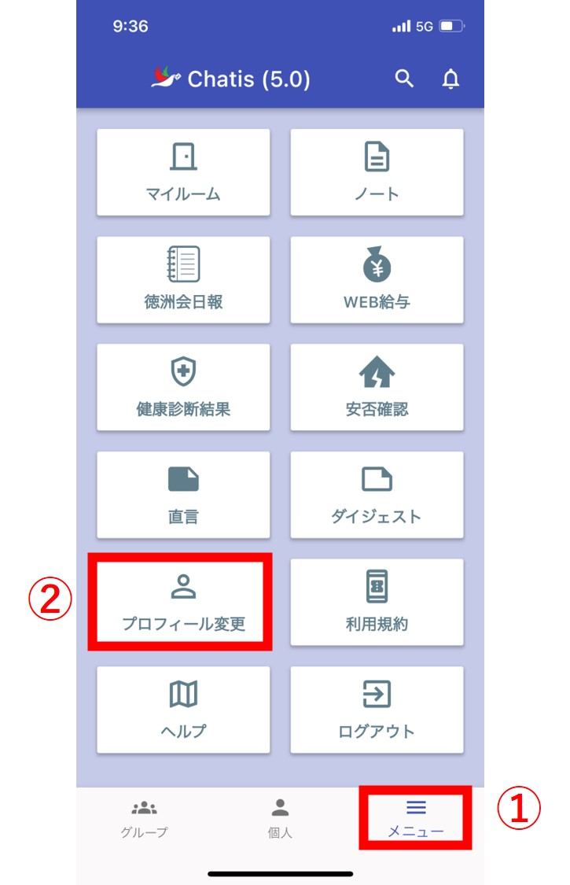

画面左上よりメニューを表示して、プロフィール変更をタップします。  
<!--    -->
  

プロフィール変更画面が起動します。  
<!--    -->
  
以下①～④はほかのユーザーも閲覧できる項目です。    
⑤～⑦はご自身でのみ確認できる項目です。  
また、②、③は変更ができません。  

①画像を変更できます。(変更できない場合は[こちら](sp_permission.md)をご覧ください。)   
②施設が表示されます。  
③部署が表示されます。  
④名前を変更できます。初回インストール時は人事システムから取得した名前が表示されます。  
⑤[sms認証](sms.md)をすると電話番号が表示されます。  
　(機種変更等で変更したい場合は[管理者](admin.md)が「電話番号初期化」を行う必要があります。)  
⑥パスワードを変更できます。    
⑦テーマカラーを変更できます。変更したテーマはブラウザ版にも反映されます。  
