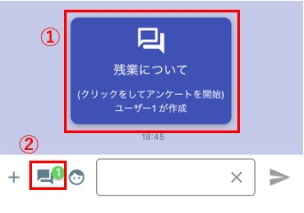
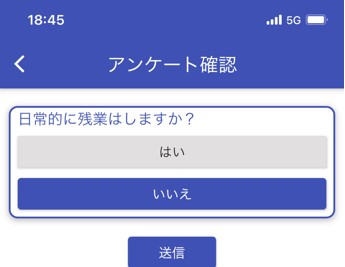
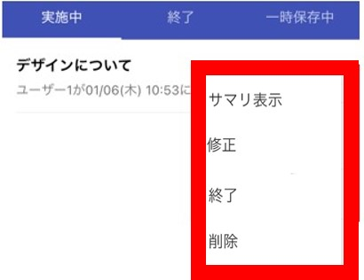
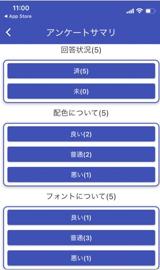
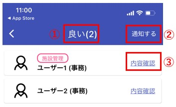
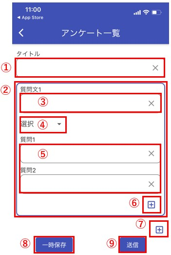

## アンケート

グループ毎にアンケートを実施することができます。    

  

① タップするとアンケート回答画面が起動します。  

② アンケート一覧画面が起動します。  
　未回答のアンケートが存在する場合は、未回答バッジがつきます。
---
### アンケート回答
  
質問に答えて「送信」ボタンをタップすることで回答済みになり、未回答バッジが消えます。  
---
### アンケート一覧
  

① 実施中タブ：タップすると実施中のアンケートが④のエリアに表示されます。  

② 終了中タブ：タップすると終了したアンケートが④のエリアに表示されます。  

③ 一時保存中タブ：タップすると一時保存中のアンケートが④のエリアに表示されます。  

④ アンケート表示エリア：アンケートを長押しするとメニューが表示されます。  

⑤ アンケートを作成することができます。  

<!--誰でもサマリが見れるようになっていた気がする-->
#### アンケート長押しでのメニュー  

  

- サマリ表示：アンケートの回答状況を確認することができます。  
　　　　　　(ご自身で作成したアンケートのみ)  

- 修正：アンケート作成画面に遷移し、内容を修正できます。  
　　　(一時作成中のみ)  

- 終了：アンケートを終了します。  
　　　終了したアンケートは②の終了タブから閲覧できます。  

- 削除：アンケートを削除します。  

!!! Warning
    削除したアンケートは閲覧できなくなります。  

#### <サマリ画面>   
アンケートの回答結果をサマリ表示できます。  
それぞれの回答結果をタップすると回答者一覧画面が表示されます。  
  

#### <回答者一覧画面>  
  
①回答した名前と人数が表示されます。  

②一覧に表示されているメンバーにプッシュ通知を送ることができます。  
!!! Example
    未回答者に「回答してください」と再通知する  

③メンバーの回答内容を見ることができます。  

---
### アンケート作成
  

<!--作成画面も変わったような気が・・・-->
アンケート作成画面の説明です。  

①アンケートのタイトルを入力します。  

②1つの質問内容の塊となります。  
　質問を増やす場合は⑦の**＋**ボタンを押してください。  

③質問のタイトルになります。  

④質問の種類になります。  

  -  単一選択：⑤の質問選択肢を入力することができます。

  -  複数選択：回答時に複数選択できる質問選択肢を⑤に入力することができます。  

  -  フリー入力：⑤の入力は不要となります。  

⑤質問選択肢を入力することができます。  
　アンケートを答えるユーザーには選択肢がボタンとして表示されます。  

⑥**＋**ボタンで質問選択肢を増やすことができます。(最大10個まで)  
　また、ゴミ箱ボタン:fa-trash:で選択肢を削除することができます。  

⑦**＋**ボタンで質問を増やすことができます。(最大10個まで)  
　また、ゴミ箱ボタン:fa-trash:で質問を削除することができます。  

⑧アンケート内容を一時保存することができます。  

⑨アンケートをグループに送信します。  
　グループのメンバーにはプッシュ通知が送信されます。 

---