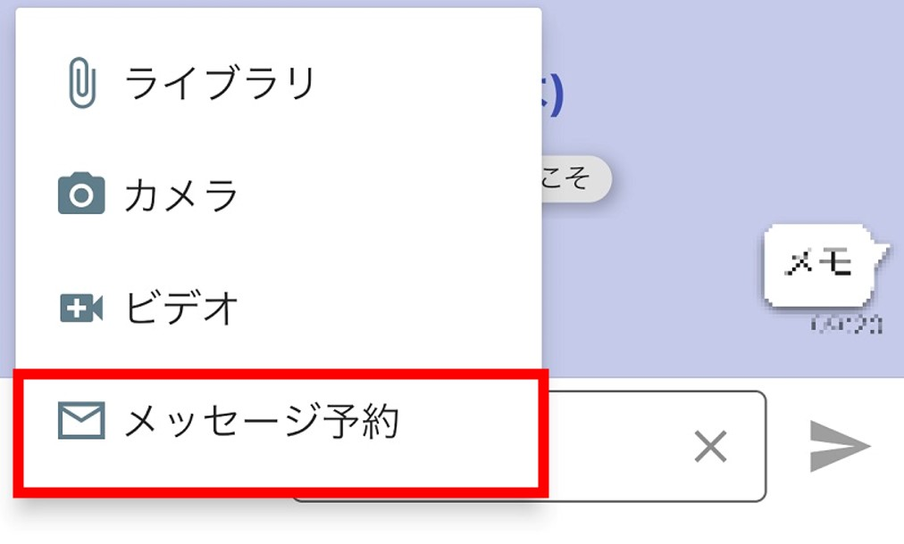
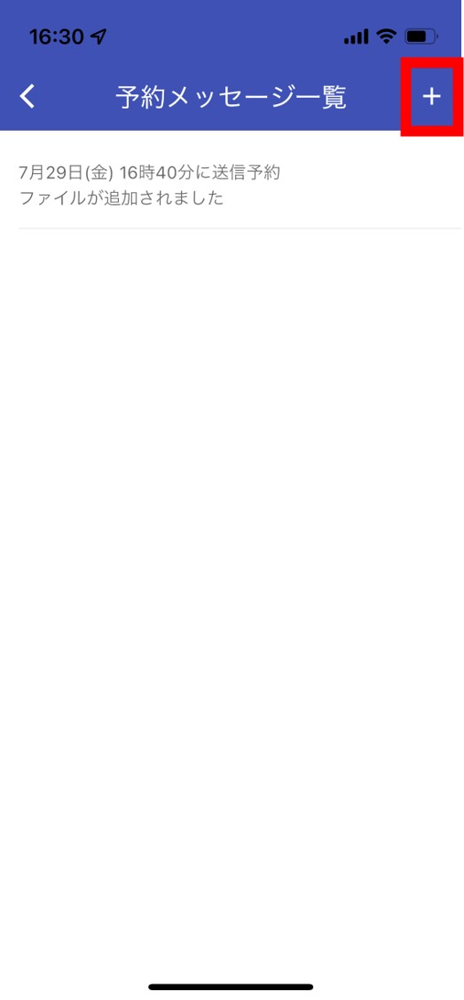
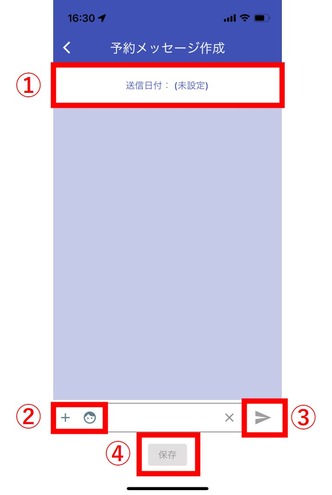
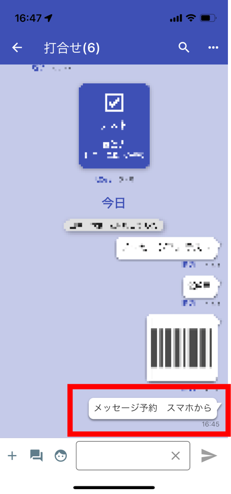

## メッセージ予約 
チャット画面の左下の**＋**ボタンから「メッセージ予約」を選択します。
<!--    -->

<!--    -->
:ボタンを押すと予約画面に遷移します。  

  
---

<!--   -->
  
①送信したい日時を選択します。    

②写真・スタンプを選択します。  

③予約したいメッセージを入力後、このボタンで仮送信します。  

④予約したいメッセージもしくは写真を全て仮送信したら、「保存」ボタンを押します。  

---

これでメッセージ予約が完了です。  
予約した時間になると自動的にメッセージが送信されます。  
<!--   -->

  
<!--   -->