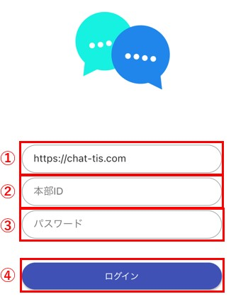
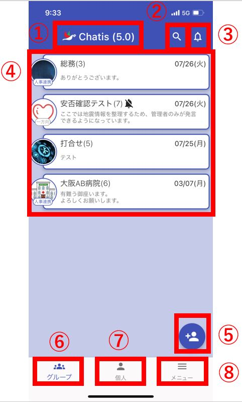
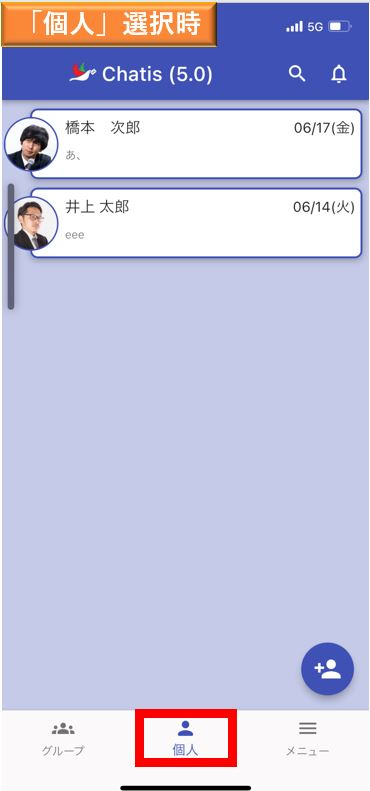
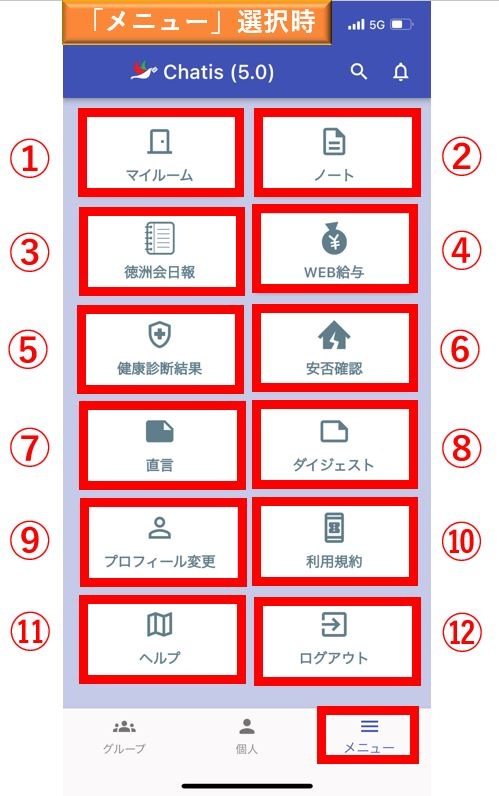
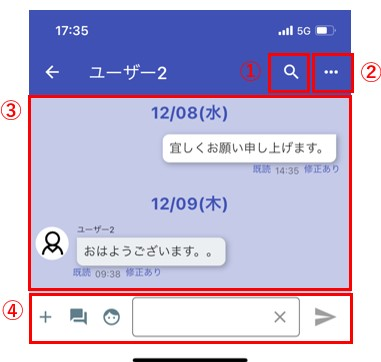
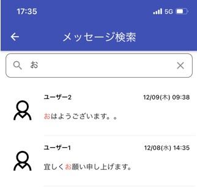
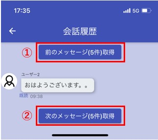

## ログイン画面

<!--    -->

①サーバーのURLを入力します。iOS(iPhone)の場合は自動で入力されています。  
　Androidの場合はご自身で「https://chat-tis.com」と入力してください。  
②自身の本部IDを入力します。  
③自身のパスワードを入力します。  
④ログインボタン  
⑤パスワードを忘れた場合はこのボタンを押してください。  
　([アカウント認証](sms.md)済みの場合のみご利用いただけます。)  
　詳しい説明は[こちら](password.md)をご覧ください。  
⑥[QRコードでログインする](startup.md)場合はこのボタンを押してください。  
<!-- ⑥QRコードでログインする場合はこのボタンを押してください。   -->

## メイン画面（グループ一覧）

<!--    -->
<!-- ①メニューを開く事ができます。ユーザーによってメニューに表示される内容が異なります。(例:給与WEB連携しているユーザーは、給与WEBのリンクが表示される)  
②Chatisのバージョンが表示されます。アプリがアップデートされるとこのバージョンも更新されます。  
③お知らせを見ることができます。  
④コンタクト・グループ一覧が表示されます。各コンタクトを長押しするとメニューが表示されます。  
⑤チャットのタブになります。初期ではこのタブが選択されています。  
⑥ニュースのタブになります。管理者によって投稿されたニュースが表示されます。   -->

 
①Chatisのバージョンが表示されます。  
　アプリがアップデートされるとこのバージョンも更新されます。  
②[検索用の入力欄](#_4)が表示されます。   
③お知らせを見ることができます。   
④グループ一覧が表示されます。  
　Chatisを開くとまず最初はこのタブが選択された状態になります。  
　各グループを長押しするとチャットの[メニュー](sp_menu.md#_1)が表示されます。    
⑤[グループ・個人間チャット新規作成画面](sp_group.md)に遷移します。(管理者のみ)  
⑥グループのタブになります。初期ではこのタブが選択されています。  
⑦[個人間チャット一覧](#_3_)が表示されます。  
⑧[メニュー](#_6_)を開く事ができます。   

## メイン画面（個人間チャット一覧）

<!--    -->

## チャット検索

以下の条件で絞り込むことができます。  

- グループ：グループ名・グループのメンバー名  
- 個人間チャット：個人名  

## メイン画面（メニュー）

<!--    -->
以下の③～⑥は管理者から[権限](admin.md#2_1)を付与されないと表示されません。

①[マイルーム]が表示されます。  
②[ノート](sp_chat.md#_8)が表示されます。  
③[日報](nipo.md)を見ることができます。   
④[WEB給与明細](salary.md)を見ることができます。   
⑤[健康診断結果](phr.md)を見ることができます。  
⑥[安否確認](anpi.md)の作成・結果一覧を見ることができます。   
⑦直言(徳洲会グループサイトより)を見ることができます。  
⑧徳洲新聞ダイジェスト(徳洲会グループサイトより)を見ることができます。  
⑨[プロフィール変更](sp_pro.md)画面へ遷移します。  
⑩利用規約を見ることができます。  
⑪[ヘルプ(マニュアル)](index.md)を見ることができます。  
⑫ログイン画面に戻ります。  

## チャット画面
グループ一覧もしくは個人間チャット一覧からチャットをタップすると、チャット画面に遷移します。  

<!--    -->
①過去のメッセージ履歴から検索するメッセージ検索画面が起動します。  
②[メニュー](sp_menu.md#_6)を開く事ができます。
③メッセージ履歴が表示されます。メッセージを長押しするとメニューが表示されます。  
④チャット欄になります。各操作は[こちら](sp_chat.md)を参照ください。  

## メッセージ検索画面
過去のメッセージを検索できます。検索されたメッセージをクリックすると、メッセージ履歴画面に遷移します。  

<!--    -->

## メッセージ履歴画面  
検索したメッセージが表示されます。  
 
<!--    -->
①検索したメッセージから前5件を取得します。  
②検索したメッセージから後ろ5件を取得します。  
