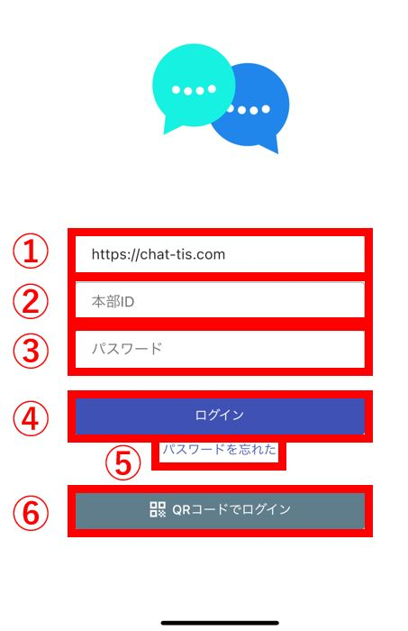

## ログイン画面
  

①サーバーのURLを入力します。iOSの場合は自動で入力されています。Androidの場合は自分で「https://chat-tis.com」を入力する必要があります。  
②自身の本部IDを入力します。  
③自身のパスワードを入力します。パスワードを忘れた場合は管理者に連絡して[初期化](password.md)して頂いて下さい。  
④ログインボタン  

## メイン画面（コンタクト・グループ一覧）
  
①メニューを開く事が出来ます。ユーザーによってメニューに表示される内容が異なります。(例:給与WEB連携しているユーザーは、給与WEBのリンクが表示される)  
②Chatisのバージョンが表示されます。アプリがアップデートされるとこのバージョンも更新されます。  
③お知らせを見ることができます。  
④コンタクト・グループ一覧が表示されます。各コンタクトを長押しするとメニューが表示されます。  
⑤チャットのタブになります。初期ではこのタブが選択されています。  
⑥ニュースのタブになります。管理者によって投稿されたニュースが表示されます。  

## チャット画面
メイン画面からコンタクト・グループをクリックすると、チャット画面に遷移します。  
  
①過去のメッセージ履歴から検索するメッセージ検索画面が起動します。  
②メニューを開く事ができます。グループの名前・画像変更などはこちらから行えます。  
③メッセージ履歴が表示されます。メッセージを長押しするとメニューが表示されます。  
④チャット欄になります。各操作は[こちら](sp_chat.md)を参照ください。  

## メッセージ検索画面
過去のメッセージを検索できます。検索されたメッセージをクリックすると、メッセージ履歴画面に遷移します。  
  

## メッセージ履歴画面
検索したメッセージが表示されます。  
  
①検索したメッセージから前5件を取得します。  
②検索したメッセージから後ろ5件を取得します。  