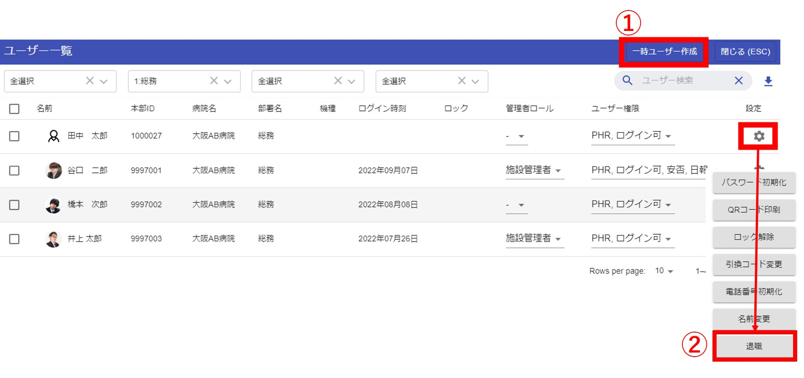
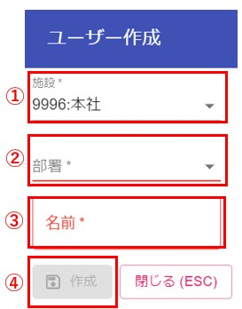
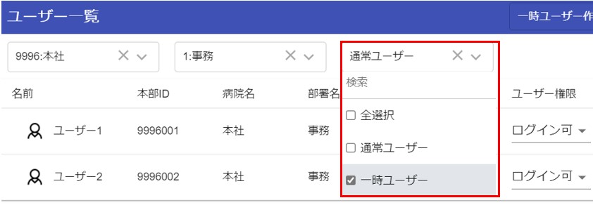

# ユーザー作成・削除

ユーザーの作成・削除は、人事システム連携で毎日AM2:00に自動的に行われます。(5/1入職の方は5/1 2:00にユーザー自動作成)  
人事システムと連携していない職員は、一時ユーザー作成画面より作成ができます。  
その場合は、作成される一時ユーザーの本部IDは、1000000からの連番となります。  
一時ユーザーは、初期状態ではどのグループ（部屋）にも所属（入室）していないので、部屋一覧画面を表示できる[管理者](admin.md)がグループに招待してください。  
ユーザー一覧画面を表示できる[管理者](admin.md)は、ブラウザ版のユーザー一覧画面からユーザー作成・削除(退職)ができます。  
  

①一時ユーザー作成画面を表示して、ユーザーを作成できます。  
②ユーザーを退職扱いにしてチャットを使用できなくします。またユーザー一覧画面にも表示されなくなります。  

## ユーザー作成画面
  
①施設選択：初期状態では自施設が選択されています。子施設がある場合は、子施設を選択する事ができます。  
②部署選択：作成するユーザーの部署を選択します。  
③名前入力：作成するユーザーの名前を入力します。  
④作成ボタン：②と③を選択・入力するとボタンが押せるようになります。  

## 一時ユーザー抽出
作成された一時ユーザーのみを抽出して表示する事もできます。  
  
